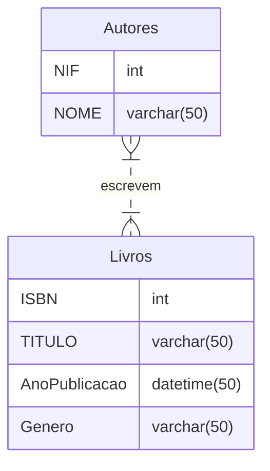

Vamos considerar um exemplo de um sistema simples de gerenciamento de biblioteca com duas entidades principais: Livro e Autor.

1. **Entidade Livro:**
   - Atributos: ISBN (chave primária), Título, Ano de Publicação, Gênero, etc.

2. **Entidade Autor:**
   - Atributos: ID Autor (chave primária), Nome do Autor, Data de Nascimento, Nacionalidade, etc.

3. **Relacionamento:**
   - Um livro pode ser escrito por um ou mais autores.
   - Um autor pode escrever um ou mais livros.

Agora, no diagrama:

- Desenhe dois retângulos, representando as entidades "Livro" e "Autor".
- Dentro de cada retângulo, liste os atributos correspondentes a cada entidade.
- Desenhe uma linha entre os retângulos "Livro" e "Autor" para representar o relacionamento. Coloque um rótulo nessa linha indicando a natureza do relacionamento, por exemplo, "Escreve".
- Se um livro pode ter vários autores ou vice-versa, use notação de "crow's foot" (um símbolo semelhante a uma pata de corvo) na extremidade da linha para indicar a multiplicidade. Por exemplo, um "crow's foot" no lado do "Autor" indicaria "muitos autores".


Para instalar o SQLServer Express, siga as instruções em:
https://learn.microsoft.com/en-us/sql/database-engine/configure-windows/sql-server-express-localdb?view=sql-server-ver16#install-localdb

(localdb)\MSSQLLocalDB
localhost\SQLEXPRESS


Para instalar o SQLServer Management Studio, siga as instruções em:
https://learn.microsoft.com/en-us/sql/ssms/download-sql-server-management-studio-ssms?view=sql-server-ver16 



**Diagrama 01** - Diagrama entidade-relacionamento simples

```SQL
CREATE TABLE Livros (   
    ISBN INT NOT NULL,
    Titulo VARCHAR(100) NOT NULL,
    AnoPublicacao INT,
    Genero VARCHAR(100),
    PRIMARY KEY (ISBN)
);

CREATE TABLE Autores (
    NIF INT NOT NULL,
    Nome VARCHAR(100) NOT NULL,
    PRIMARY KEY (NIF)
);

Create Table Autorias (
    ISBN INT NOT NULL,
    NIF INT NOT NULL,    
    PRIMARY KEY (ISBN, NIF),
    FOREIGN KEY (ISBN) REFERENCES Livros (ISBN),
    FOREIGN KEY (NIF) REFERENCES Autores (NIF
```
**Código 01** - Criação tabelas 

```SQL	
INSERT INTO Livros (ISBN, Titulo, AnoPublicacao, Genero) VALUES (1, 'O Senhor dos Anéis', 1954, 'Fantasia');

INSERT INTO Livros (ISBN, Titulo, AnoPublicacao, Genero) VALUES (2, 'O Hobbit', 1937, 'Fantasia');

INSERT INTO Livros (ISBN, Titulo, AnoPublicacao, Genero) VALUES (3, 'O Silmarillion', 1977, 'Fantasia');

INSERT INTO Autores (NIF, Nome) VALUES (1, 'J. R. R. Tolkien');
INSERT INTO Autores (NIF, Nome) VALUES (2, 'Christopher Tolkien');

INSERT INTO Autorias (ISBN, NIF) VALUES (1, 1);
INSERT INTO Autorias (ISBN, NIF) VALUES (2, 1);
INSERT INTO Autorias (ISBN, NIF) VALUES (3, 1);
```
**Código 02** - Inserção de dados


```SQL
SELECT * FROM Livros;

SELECT * FROM Autores WHERE NIF = 1;

SELECT a1.Nome, a3.Titulo 
FROM Autorias a2
LEFT JOIN autores a1 ON a1.NIF = a2.NIF
LEFT JOIN Livros a3 ON a3.ISBN = a2.ISBN;
```
**Código 03** - Consultas

```SQL
DELETE FROM Autorias WHERE ISBN = 3;
```
**Código 04** - Exclusão de dados

```SQL
UPDATE Livros SET AnoPublicacao = 1977 WHERE ISBN = 1;
```
**Código 05** - Exclusão de dados

Se você estiver usando uma ferramenta específica para criar diagramas de entidade-relacionamento, como o MySQL Workbench, você pode arrastar e soltar entidades e relacionamentos para construir seu diagrama visualmente.

Lembre-se de que este é apenas um exemplo simples. Diagramas de entidade-relacionamento podem se tornar mais complexos com mais entidades e relacionamentos dependendo dos requisitos do sistema que você está modelando.