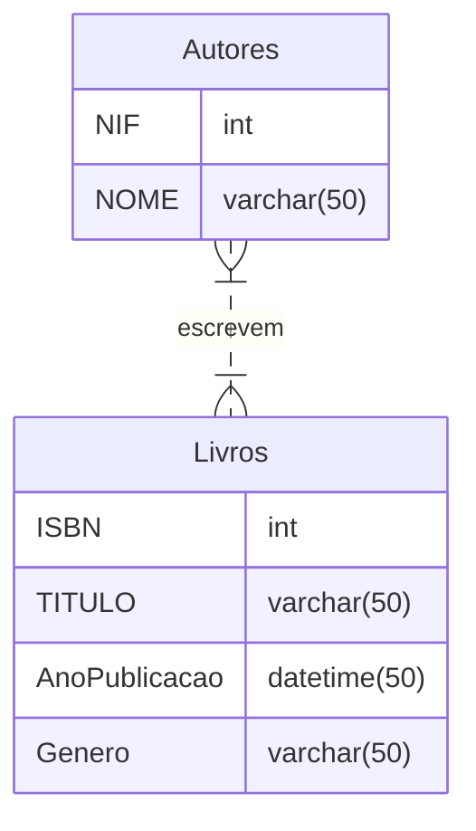
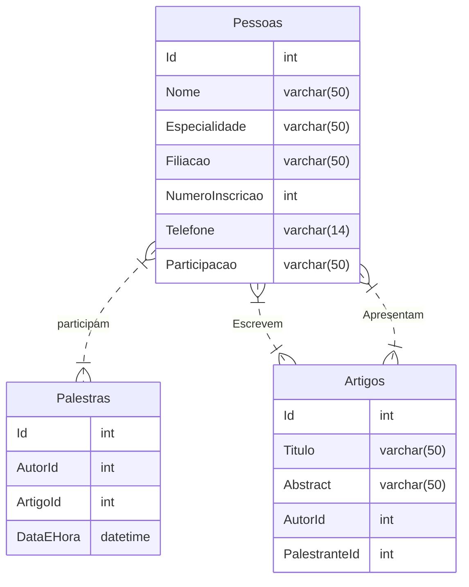
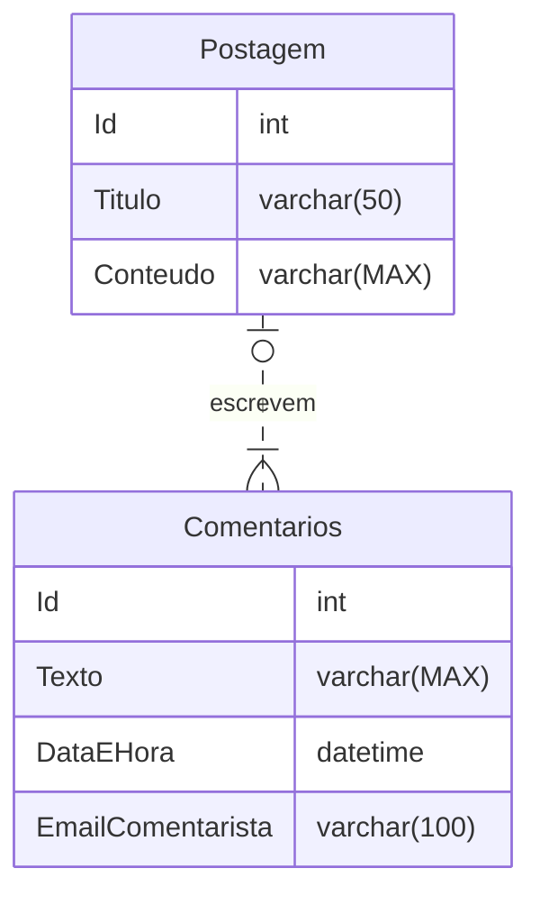

Vamos considerar um exemplo de um sistema simples de gerenciamento de biblioteca com duas entidades principais: Livro e Autor.

1. **Entidade Livro:**
   - Atributos: ISBN (chave primária), Título, Ano de Publicação, Gênero, etc.

2. **Entidade Autor:**
   - Atributos: ID Autor (chave primária), Nome do Autor, Data de Nascimento, Nacionalidade, etc.

3. **Relacionamento:**
   - Um livro pode ser escrito por um ou mais autores.
   - Um autor pode escrever um ou mais livros.

Agora, no diagrama:

- Desenhe dois retângulos, representando as entidades "Livro" e "Autor".
- Dentro de cada retângulo, liste os atributos correspondentes a cada entidade.
- Desenhe uma linha entre os retângulos "Livro" e "Autor" para representar o relacionamento. Coloque um rótulo nessa linha indicando a natureza do relacionamento, por exemplo, "Escreve".
- Se um livro pode ter vários autores ou vice-versa, use notação de "crow's foot" (um símbolo semelhante a uma pata de corvo) na extremidade da linha para indicar a multiplicidade. Por exemplo, um "crow's foot" no lado do "Autor" indicaria "muitos autores".


Para instalar o SQLServer Express, siga as instruções em:
https://learn.microsoft.com/en-us/sql/database-engine/configure-windows/sql-server-express-localdb?view=sql-server-ver16#install-localdb

(localdb)\MSSQLLocalDB
localhost\SQLEXPRESS


Para instalar o SQLServer Management Studio, siga as instruções em:
https://learn.microsoft.com/en-us/sql/ssms/download-sql-server-management-studio-ssms?view=sql-server-ver16 



**Diagrama 01** - Diagrama entidade-relacionamento simples

```SQL
CREATE TABLE Livros (   
    ISBN INT NOT NULL,
    Titulo VARCHAR(100) NOT NULL,
    AnoPublicacao INT,
    Genero VARCHAR(100),
    PRIMARY KEY (ISBN)
);

CREATE TABLE Autores (
    NIF INT NOT NULL,
    Nome VARCHAR(100) NOT NULL,
    PRIMARY KEY (NIF)
);

Create Table Autorias (
    ISBN INT NOT NULL,
    NIF INT NOT NULL,    
    PRIMARY KEY (ISBN, NIF),
    FOREIGN KEY (ISBN) REFERENCES Livros (ISBN),
    FOREIGN KEY (NIF) REFERENCES Autores (NIF
```
**Código 01** - Criação tabelas 

```SQL	
INSERT INTO Livros (ISBN, Titulo, AnoPublicacao, Genero) VALUES (1, 'O Senhor dos Anéis', 1954, 'Fantasia');

INSERT INTO Livros (ISBN, Titulo, AnoPublicacao, Genero) VALUES (2, 'O Hobbit', 1937, 'Fantasia');

INSERT INTO Livros (ISBN, Titulo, AnoPublicacao, Genero) VALUES (3, 'O Silmarillion', 1977, 'Fantasia');

INSERT INTO Autores (NIF, Nome) VALUES (1, 'J. R. R. Tolkien');
INSERT INTO Autores (NIF, Nome) VALUES (2, 'Christopher Tolkien');

INSERT INTO Autorias (ISBN, NIF) VALUES (1, 1);
INSERT INTO Autorias (ISBN, NIF) VALUES (2, 1);
INSERT INTO Autorias (ISBN, NIF) VALUES (3, 1);
```
**Código 02** - Inserção de dados


```SQL
SELECT * FROM Livros;

SELECT * FROM Autores WHERE NIF = 1;

SELECT a1.Nome, a3.Titulo 
FROM Autorias a2
LEFT JOIN autores a1 ON a1.NIF = a2.NIF
LEFT JOIN Livros a3 ON a3.ISBN = a2.ISBN;
```
**Código 03** - Consultas

```SQL
DELETE FROM Autorias WHERE ISBN = 3;
```
**Código 04** - Exclusão de dados

```SQL
UPDATE Livros SET AnoPublicacao = 1977 WHERE ISBN = 1;
```
**Código 05** - Exclusão de dados

Se você estiver usando uma ferramenta específica para criar diagramas de entidade-relacionamento, como o MySQL Workbench, você pode arrastar e soltar entidades e relacionamentos para construir seu diagrama visualmente.

Lembre-se de que este é apenas um exemplo simples. Diagramas de entidade-relacionamento podem se tornar mais complexos com mais entidades e relacionamentos dependendo dos requisitos do sistema que você está modelando.

**Exemplos de queries**

```SQL
--Listar os autores
SELECT Nome, NIF, Id
FROM Autor

--Listar os livros
SELECT Titulo, AnoPublicacao
FROM Livro

--Listar os livros com autores //JOIN Implícito
SELECT Titulo, AnoPublicacao, Nome, NIF
FROM Livro, Autor, Autoria
WHERE autor.Id = Autoria.AutorId
  AND Autoria.LivroId = livro.Id

--Listar os livros com autores //JOIN Explícito
SELECT Titulo, AnoPublicacao, Nome, NIF
FROM Livro
JOIN Autoria ON Autoria.LivroId = Livro.Id
JOIN Autor ON autor.Id = Autoria.AutorId
WHERE Autor.Nome = 'Ziraldo'


-- 'O menino maluquinho', trazer nome do autor
SELECT autor.Nome
FROM Autor, Livro, Autoria 
WHERE autor.Id = Autoria.AutorId
  AND Autoria.LivroId = livro.Id
  AND livro.Titulo = 'O menino maluquinho'

SELECT autor.Nome
FROM Livro
JOIN Autoria ON Autoria.LivroId = Livro.Id
JOIN Autor ON autor.Id = Autoria.AutorId
WHERE livro.Titulo = 'O menino maluquinho'

SELECT a.Nome
FROM Livro l
JOIN Autoria ON Autoria.LivroId = l.Id
JOIN Autor a ON a.Id = Autoria.AutorId
WHERE l.Titulo = 'O menino maluquinho'

--Busca dos dados após a normalização para Autoria
-- Agora consigo muitos livros para muitos autores
SELECT Autor.Nome, Livro.Titulo 
FROM Autor
JOIN Autoria ON Autoria.AutorId = Autor.Id 
JOIN Livro ON Livro.Id = Autoria.LivroId


INSERT INTO Livro (Titulo, ISBN, AnoPublicacao) VALUES ('O Duplo', '123', 1990)
SELECT * FROM Livro
--7

INSERT INTO Autor (Nome, NIF, DataNascimento) VALUES ('Dostoievski', '1234', 1821)
INSERT INTO Autor (Nome, NIF, DataNascimento) VALUES ('Catarina', '12345', 2000)

SELECT * FROM Autor


--3,4

INSERT INTO Autoria (AutorId, LivroId) VALUES (3, 7)
INSERT INTO Autoria (AutorId, LivroId) VALUES (4, 7)

SELECT Autor.Nome, Livro.Titulo
FROM Autor
JOIN Autoria ON Autoria.AutorId = Autor.Id
JOIN Livro ON Livro.Id = Autoria.LivroId
WHERE Livro.Titulo = 'O Duplo'


SELECT * FROM Autoria
WHERE AutorId = 15 
  AND LivroId = 8

INSERT INTO Autoria (AutorId, LivroId) VALUES (15, 8)


DELETE FROM Autoria
WHERE AutorId = 15 
  AND LivroId = 8


SELECT *
FROM Autor
WHERE Autor.DataNascimento >= '01-01-2000'

SELECT UPPER('Nome')

SELECT TOP 5 * FROM Autor

```


**Exemplo de diagrama entidade-relacionamento - Conferência Científica**



### Lista de exercícios sobre comandos SQL para praticar suas habilidades:

1. **Seleção de Dados:**
   - Escreva uma consulta para selecionar todos os dados de uma tabela específica.
   - Selecione apenas algumas colunas de uma tabela.
   - Use a cláusula WHERE para filtrar os resultados com base em uma condição específica.

2. **Ordenação e Limitação:**
   - Ordene os resultados de uma consulta em ordem ascendente e descendente.
   - Limite o número de resultados retornados em uma consulta.

3. **Agregação de Dados:**
   - Escreva uma consulta para calcular a média, soma e contagem de uma coluna numérica.
   - Utilize GROUP BY para agrupar dados com base em uma coluna específica.

4. **Filtragem Avançada:**
   - Use a cláusula LIKE para buscar registros que contenham um padrão específico.
   - Utilize IN ou NOT IN para filtrar registros com base em uma lista de valores.

5. **Junção de Tabelas:**
   - Faça uma consulta que envolva a junção de duas ou mais tabelas.
   - Experimente INNER JOIN, LEFT JOIN e RIGHT JOIN em diferentes cenários.

6. **Atualização e Inserção de Dados:**
   - Atualize registros em uma tabela com base em uma condição específica.
   - Insira novos registros em uma tabela.

7. **Exclusão de Dados:**
   - Exclua registros com base em uma condição.
   - Experimente usar a cláusula CASCADE para excluir registros relacionados em cascata.

8. **Subconsultas:**
   - Escreva uma subconsulta para encontrar dados com base em resultados de outra consulta.
   - Utilize as cláusulas EXISTS ou NOT EXISTS em uma subconsulta.

9. **Transações:**
   - Inicie uma transação, faça algumas alterações e depois faça o commit.
   - Realize uma transação de rollback para desfazer alterações.

10. **Restrições e Índices:**
    - Adicione uma restrição UNIQUE a uma coluna.
    - Crie um índice em uma tabela para melhorar o desempenho da consulta.

Lembre-se de adaptar os exercícios de acordo com o sistema de gerenciamento de banco de dados que você está utilizando (por exemplo, MySQL, PostgreSQL, SQL Server, etc.). Boa prática!

### Referências

```SQL
SELECT COUNT(Id), Participacao
FROM Pessoas
WHERE Filiacao IS NOT NULL
GROUP BY Participacao


SELECT Nome
FROM Pessoas 
WHERE Participacao IN ('Autor','Palestrante')


SELECT Nome
FROM Pessoas 
WHERE Participacao = 'Autor'
   OR Participacao ='Palestrante'


SELECT * from Pessoas

--COUNT
--ORDER BY 
--MAX
--AVG
--MIN


SELECT COUNT(Id), Participacao
FROM Pessoas
GROUP BY Participacao
HAVING COUNT(Id) > 2


SELECT * 
FROM Pessoas P1
WHERE P1.Nome IN (
	SELECT Nome
	FROM Pessoas P2
	WHERE P2.Filiacao = 'ISCTE'
)


INSERT INTO Artigos (Titulo, Abstract, AutorId, PalestranteId)
	          VALUES ('Artigo 01', 'Abstract 01', 1, 1)


SELECT p.Nome, a.Titulo
FROM Pessoas p
LEFT JOIN Artigos a ON a.AutorId = p.Id

DELETE FROM Artigos WHERE Id = 15

UPDATE Artigos SET Abstract = '' WHERE Id = 15


```

### Gerar classes a partir do database

https://learn.microsoft.com/en-us/ef/core/managing-schemas/scaffolding/?tabs=dotnet-core-cli

```PowerShell
dotnet tool install --global dotnet-ef

dotnet add package Microsoft.EntityFrameworkCore.Design

dotnet add package Microsoft.EntityFrameworkCore.SqlServer

dotnet ef dbcontext scaffold "Data Source=(localdb)\MSSQLLocalDB;Initial Catalog=ConferenciaCientifica" Microsoft.EntityFrameworkCore.SqlServer
```


```csharp
ConferenciaCientificaContext db = new ConferenciaCientificaContext();

Pessoa pessoa = new Pessoa();
pessoa.Nome = "Maria das Couves 29/01/2024 - 1 ";
pessoa.Participacao = "Autor";
db.Pessoas.Add(pessoa);

Artigo artigo = new Artigo();
artigo.Abstract = "Meu artigo abstract - 1";
artigo.Titulo = "Título do Artigo - 1";
artigo.Palestrante = pessoa;
artigo.Autor = pessoa;
db.Artigos.Add(artigo);


Palestra palestra01 = new Palestra();
palestra01.Autor = pessoa;
palestra01.Artigo = artigo;
palestra01.DataEhora = new DateTime(2024, 01, 29, 20, 30, 0);
db.Palestras.Add(palestra01);

Palestra palestra02 = new Palestra();
palestra02.Autor = pessoa;
palestra02.Artigo = artigo;
palestra02.DataEhora = new DateTime(2024, 01, 30, 10, 30, 0);
db.Palestras.Add(palestra02);


db.SaveChanges();

```
***Código*** - Exemplo de inserção de dados em tabelas relacionadas

```csharp

## Aula 04 - Introdução ao CodeFirst e Migrations





***Referências:***

1 - https://learn.microsoft.com/pt-pt/training/modules/build-web-api-minimal-database/5-exercise-use-sqlite-database

2 - https://docs.microsoft.com/en-us/ef/core/managing-schemas/migrations/?tabs=dotnet-core-cli

3 - https://docs.microsoft.com/en-us/ef/core/cli/dotnet

4 - 
https://learn.microsoft.com/en-us/aspnet/mvc/overview/older-versions/mvc-music-store/mvc-music-store-part-6 

5 - https://learn.microsoft.com/en-us/ef/core/modeling/relationships/mapping-attributes

´´´PowerShell
dotnet tool install --global dotnet-ef

dotnet add package Microsoft.EntityFrameworkCore.Sqlite 

dotnet add package Microsoft.EntityFrameworkCore.Design
´´´ 
***Código 01*** - Instalação de pacotes


```csharp
    protected override void OnConfiguring(DbContextOptionsBuilder optionsBuilder) => optionsBuilder.UseSqlite("Data Source=Pizzas.db");
```
***Código 02*** - Criação da connectionstring no DBContext


´´´PowerShell
dotnet ef migrations add InitialCreate

dotnet ef database update
´´´ 
***Código 03*** - Criação da primeira migração


´´´SQL
SELECT p.Titulo, g.Nome, c.Texto
FROM  Postagens p
LEFT JOIN Comentarios c ON c.PostagemId = p.Id
LEFT JOIN Comentaristas g ON g.Id = c.ComentaristaId


´´´


### Databases não relacionais

https://cloud.mongodb.com/

https://www.mongodb.com/products/tools/compass 

https://www.mongodb.com/developer/products/mongodb/cheat-sheet/#crud

https://learn.microsoft.com/en-us/azure/cosmos-db/mongodb/introduction


## Create a web.api with MongoDB/CosmosDB

https://learn.microsoft.com/en-us/aspnet/core/tutorials/first-mongo-app?view=aspnetcore-8.0&tabs=visual-studio


## Usar um banco de dados com API mínima, Entity Framework Core e ASP.NET Core
https://learn.microsoft.com/pt-pt/training/modules/build-web-api-minimal-database/1-introduction