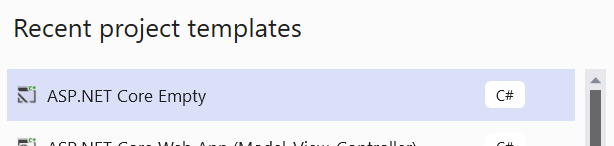
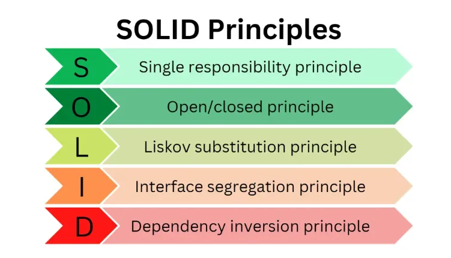

# ASP.NET MVC

## Aula 01 - ASP.NET MVC


- Procurar Livro: (20486D-DevelopingASPNETMVCWebApplications Trainer handbook.pdf)

- [ASP.NET MVC Microsoft](https://github.com/MicrosoftLearning/20486D-DevelopingASPNETMVCWebApplications)

- [Exercício 01](https://github.com/MicrosoftLearning/20486D-DevelopingASPNETMVCWebApplications/blob/master/Instructions/20486D_MOD01_LAK.md)

- [Exercício 02](https://github.com/MicrosoftLearning/20486D-DevelopingASPNETMVCWebApplications/blob/master/Instructions/20486D_MOD02_LAK.md)


## Aula 02 - Middleware

- [Middleware](https://docs.microsoft.com/en-us/aspnet/core/fundamentals/middleware/?view=aspnetcore-8.0)


- [Dependency injection in ASP.NET Core](https://learn.microsoft.com/en-us/aspnet/core/fundamentals/dependency-injection?view=aspnetcore-8.0)


- [Exercício 01 - Middleware](https://github.com/MicrosoftLearning/20486D-DevelopingASPNETMVCWebApplications/blob/master/Instructions/20486D_MOD03_LAK.md)

### Módulo 3: Configurando Middleware e Serviços no ASP.NET Core

Onde quer que um caminho para um arquivo comece com *[Repository Root]*, substitua-o pelo caminho absoluto para a pasta na qual reside o repositório 20486. Por exemplo, se você clonou ou extraiu o repositório 20486 para **C:\Users\John Doe\Downloads\20486**, altere o caminho: **[Repository Root]\AllFiles\20486D\Mod01** para **C:\Users\John Doe\Downloads\20486\AllFiles\20486D\Mod01**.

<details>
  <summary>Em português</summary>

# Laboratório: Configurando Middleware e Serviços no ASP.NET Core

### Configuração do Laboratório

Tempo Estimado: **75 minutos**

### Etapas de Preparação

Certifique-se de ter clonado o diretório 20486D do GitHub. Ele contém os segmentos de código para os laboratórios e demonstrações neste curso. (**https://github.com/MicrosoftLearning/20486D-DevelopingASPNETMVCWebApplications/tree/master/Allfiles**).

###	Exercício 1: Trabalhando com Arquivos Estáticos

#### Tarefa 1: Criar um novo projeto usando o modelo de projeto ASP.NET Core vazio

1. Inicie o Microsoft Visual Studio 2017.

2. Na janela **Página Inicial - Microsoft Visual Studio**, no menu **ARQUIVO**, aponte para **Novo** e clique em **Projeto**.

3. Na caixa de diálogo **Novo Projeto**, no painel de navegação, expanda **Instalado** e clique em **Visual C#**.

4. Na caixa de diálogo **Novo Projeto**, no painel de resultados, clique em **Aplicativo Web ASP.NET Core**.

5. Na caixa **Nome**, insira **PollBall**.

6. Na caixa **Localização**, insira **[Repository Root]Allfiles\Mod03\Labfiles\01_PollBall_begin** e clique em **OK**.

7. Na caixa de diálogo **Nova Aplicação Web ASP.NET Core - PollBall**, no painel de resultados, clique em **Vazio**. Certifique-se de que as caixas de seleção estejam desmarcadas e clique em **OK**.

8. Na janela **PollBall - Microsoft Visual Studio**, no menu **DEBUG**, clique em **Iniciar Sem Depuração**.

9. No Microsoft Edge, na barra de endereços, observe o número da porta que aparece no final do URL **http://localhost:[port]**. Você usará o número da porta durante este laboratório.

10. No Microsoft Edge, clique em **Fechar**.

11. Na janela **PollBall - Microsoft Visual Studio**, no **Solution Explorer**, clique em **Program.cs**.

12. Na janela de código **Program.cs**, insira o seguinte código:
```cs
        app.Run(async (context) =>
        {
             await context.Response.WriteAsync("Este texto foi gerado pelo middleware app.Run.");
        });
```

#### Tarefa 2: Executar o aplicativo

1. Na janela **PollBall - Microsoft Visual Studio**, no menu **ARQUIVO**, clique em **Salvar Tudo**.

2. Na janela **PollBall - Microsoft Visual Studio**, no menu **DEBUG**, clique em **Iniciar Sem Depuração**.
> **Observação**: O navegador exibe **Este texto foi gerado pelo middleware app.Run**.

3. No Microsoft Edge, clique em **Fechar**.

#### Tarefa 3: Adicionar um arquivo HTML à pasta wwwroot

1. Na janela **PollBall - Microsoft Visual Studio**, no **Solution Explorer**, clique com o botão direito em **wwwroot**, aponte para **Adicionar** e clique em **Nova Pasta**.

2. Na caixa **NovaPasta**, insira **css** e pressione Enter.

3. No Explorador de Arquivos, vá para **[Repository Root]Allfiles\Mod03\Labfiles\01_PollBall_begin**.

4. Na janela **01_PollBall_begin**, clique com o botão direito em **style.css** e clique em **Copiar**.

5. No Explorador de Arquivos, navegue até **[Repository Root]Allfiles\Mod03\Labfiles\01_PollBall_begin\PollBall\PollBall\wwwroot\css**.

6. No Explorador de Arquivos, clique com o botão direito em um espaço vazio e clique em **Colar**.
    > **Observação**: Verifique no Solution Explorer, sob **wwwroot**, na pasta **css**, que o arquivo **style.css** está sendo exibido.

7. No Explorador de Arquivos, vá para **[Repository Root]Allfiles\Mod03\Labfiles\01_PollBall_begin**.

8. Na janela **01_PollBall_begin**, clique com o botão direito em **images** e clique em **Copiar**.

9. No Explorador de Arquivos, vá para **[Repository Root]Allfiles\Mod03\Labfiles\01_PollBall_begin\PollBall\PollBall\wwwroot**.

10. No Explorador de Arquivos, clique com o botão direito em um espaço vazio e clique em **Colar**.
    > **Observação**: Verifique no Solution Explorer, sob **wwwroot**, que a pasta **images** está sendo exibida.

11. Na janela **PollBall - Microsoft Visual Studio**, no **Solution Explorer**, clique com o botão direito em **wwwroot**, aponte para **Adicionar** e clique em **Novo Item**.

12. Na caixa de diálogo **Adicionar Novo Item - PollBall**, expanda **Instalado**, clique em **ASP.NET Core** e clique em **Página HTML**.

13. Na caixa de diálogo **Adicionar Novo Item - PollBall**, na caixa **Nome**, insira **poll-questions** e clique em **Adicionar**.

14. Na janela de código **poll-questions.html**, no elemento **BODY**, insira o seguinte código e pressione Enter.
```cs
    <p>
        <h1>Enquete de Jogos de Bola Favoritos</h1>
        Por favor, selecione seu jogo de bola favorito e pressione Enviar Enquete.
    </p>
```

15. No elemento **BODY**, abaixo do elemento **P**, insira o seguinte código:
```cs
    <form class="submit-form">
        <div class="main-div">

        </div>
        <div

 class="submit-batch">
            <input type="submit" value="Enviar Enquete" />
        </div>
    </form>
```

16. No elemento **DIV**, no atributo de classe **main-div**, insira o seguinte código abaixo do código que você acabou de adicionar e pressione Enter.
```cs
    <div class="main-batch1">
        <div class="item">
            <div class="img-item"></div>
            <div class="input-item"><input type="radio" name="favorite" value="Basquete"> Basquete</div>
        </div>
        <div class="item">
            <div class="img-item"></div>
            <div class="input-item"><input type="radio" name="favorite" value="Futebol"> Futebol</div>
        </div>
        <div class="item">
            <div class="img-item"></div>
            <div class="input-item"><input type="radio" name="favorite" value="Futebol"> Futebol</div>
        </div>
        <div class="item">
            <div class="img-item"></div>
            <div class="input-item"><input type="radio" name="favorite" value="Vôlei"> Vôlei</div>
        </div>
    </div>
```

17. No elemento **DIV**, no atributo de classe **main-div**, abaixo do código que você acabou de adicionar, insira o seguinte código:
```cs
    <div class="main-batch2">
        <div class="item">
            <div class="img-item"></div>
            <div class="input-item"><input type="radio" name="favorite" value="Bilhar"> Bilhar</div>
        </div>
        <div class="item">
            <div class="img-item"></div>
            <div class="input-item"><input type="radio" name="favorite" value="Golfe"> Golfe</div>
        </div>
        <div class="item">
            <div class="img-item"></div>
            <div class="input-item"><input type="radio" name="favorite" value="Hóquei"> Hóquei</div>
        </div>
        <div class="item">
            <div class="img-item"></div>
            <div class="input-item"><input type="radio" name="favorite" value="Tênis"> Tênis</div>
        </div>
    </div>
```

#### Tarefa 4: Executar o aplicativo – conteúdo do arquivo HTML não é exibido

1. Na janela **PollBall - Microsoft Visual Studio**, no menu **ARQUIVO**, clique em **Salvar Tudo**.

2. Na janela **PollBall - Microsoft Visual Studio**, no menu **DEBUG**, clique em **Iniciar Sem Depuração**.

3. No Microsoft Edge, na barra de endereços, insira **http://localhost:[port]/poll-questions.html** e pressione Enter.
    > **Observação**: O navegador exibe **Este texto foi gerado pelo middleware app.Run.** e não o conteúdo do arquivo **poll-questions.html**.

4. No Microsoft Edge, clique em **Fechar**.

#### Tarefa 5: Habilitar o uso de arquivos estáticos

1. Na janela **PollBall - Microsoft Visual Studio**, no **Solution Explorer**, clique em **Startup.cs**.

2. Na janela de código **Startup.cs**, localize o seguinte código:
```cs
    public void Configure(IApplicationBuilder app)
    {
```

3. Coloque o cursor após o sinal de **{** (chaves de abertura), pressione Enter, insira o seguinte código e pressione Enter.
```cs
    app.UseStaticFiles();
```

#### Tarefa 6: Executar o aplicativo – conteúdo do arquivo HTML é exibido

1. Na janela **PollBall - Microsoft Visual Studio**, no menu **ARQUIVO**, clique em **Salvar Tudo**.

2. Na janela **PollBall - Microsoft Visual Studio**, no menu **DEBUG**, clique em **Iniciar Sem Depuração**.

3. No Microsoft Edge, na barra de endereços, insira **http://localhost:[port]/poll-questions.html** e pressione Enter.
    > **Observação**: O navegador exibe o conteúdo do arquivo **poll-questions.html**, mas o conteúdo HTML ainda não foi estilizado por um arquivo CSS.

4. No Microsoft Edge, clique em **Fechar**.

5. No Solution Explorer, em **wwwroot**, clique em **poll-questions.html**.

6. Na janela de código **poll-questions.html**, no elemento **HEAD**, abaixo do elemento **TITLE**, insira o seguinte código:
```cs
    <link type="text/css" rel="stylesheet" href="css/style.css" />
```

7. Na janela **PollBall - Microsoft Visual Studio**, no menu **ARQUIVO**, clique em **Salvar Tudo**.

8. Na janela **PollBall - Microsoft Visual Studio**, no menu **DEBUG**, clique em **Iniciar Sem Depuração**.

9. No Microsoft Edge, na barra de endereços, insira **http://localhost:[port]/poll-questions.html** e pressione Enter.
    > **Observação**: O navegador exibe o conteúdo do arquivo **poll-questions.html** que foi estilizado usando o arquivo **style.css**.

10. No Microsoft Edge, clique em **Fechar**.

#### Tarefa 7: Adicionar um arquivo HTML fora da pasta wwwroot

1. No Explorador de Arquivos, navegue até **[Repository Root]Allfiles\Mod03\Labfiles\01_PollBall_begin**, clique com o botão direito em **test.html** e clique em **Copiar**. 

2. No Explorador de Arquivos, navegue até **[Repository Root]Allfiles\Mod03\Labfiles\01_PollBall_begin\PollBall\PollBall**, clique com o botão direito em um espaço vazio e clique em **Colar**.

#### Tarefa 8: Executar o aplicativo – conteúdo do arquivo HTML fora da pasta wwwroot não é exibido

1. Na janela **PollBall - Microsoft Visual Studio**, no menu **DEBUG**, clique em **Iniciar Sem Depuração**.

2. No Microsoft Edge, na barra de endereços, insira **http://localhost:[port]/test.html** e pressione Enter.
    > **Observação**: O navegador exibe **Este texto foi gerado pelo middleware app.Run.** Por padrão, o navegador não pode exibir arquivos estáticos que estão fora do diretório **

wwwroot**.

3. No Microsoft Edge, clique em **Fechar**.

> **Resultado**: No final deste exercício, você será capaz de trabalhar com arquivos estáticos dentro de um projeto Microsoft ASP.NET Core.
</details> 

**Cuidado** O exercício foi feito no VS2017, para o VS2022 utilizamos o projeto em branco e adicionamos o código do exercício.



```csharp	
using DependencyInjectionSample.Interfaces;
using DependencyInjectionSample.Services;

var builder = WebApplication.CreateBuilder(args);

builder.Services.AddRazorPages();

builder.Services.AddScoped<IMyDependency, MyDependency2>();

builder.Services.AddSingleton<IMyDependencySing, MyDependencySing2>();

var app = builder.Build();
```

[Solid Principles](https://blog.stackademic.com/solid-principles-explained-with-real-time-examples-e39d1c167ba5)




<details>
<summary> Em português </summary>

### Exercício 2: Criando Middleware Personalizado

#### Tarefa 1: Criar um middleware

1. Na janela **PollBall - Microsoft Visual Studio**, no Solution Explorer, clique em **Startup.cs**.

2. Na janela de código **Startup.cs**, localize o seguinte código:
```cs
    public void Configure(IApplicationBuilder app)
    {
```

3. Coloque o cursor após o sinal de **{** (chaves de abertura), pressione Enter, insira o seguinte código e pressione Enter.
```cs
    app.Use(async (context, next) =>
    {
    
    });
```

4. Coloque o cursor dentro do bloco de código **app.Use**, e então insira o seguinte código:
```cs
    if (context.Request.Query.ContainsKey("favorite"))
    {
    
    }
``` 

5. No bloco de código **if**, insira o seguinte código e pressione Enter duas vezes.
```cs
    string selectedValue = context.Request.Query["favorite"];
```

6. No bloco de código **if**, abaixo da última instrução inserida, insira o seguinte código:
```cs
    await context.Response.WriteAsync("O valor selecionado é: " + selectedValue);
```
7. No bloco de código **app.Use**, coloque o cursor após o sinal de **}** (chaves de fechamento) da instrução **if**, pressione Enter e, em seguida, insira o seguinte código:
```cs
    else 
    {
        await next.Invoke();
    }
```
#### Tarefa 2: Executar a aplicação

1. Na janela **PollBall - Microsoft Visual Studio**, no menu **FILE**, clique em **Salvar Tudo**.

2. Na janela **PollBall - Microsoft Visual Studio**, no menu **DEBUG**, clique em **Iniciar sem Depuração**.

3. No Microsoft Edge, na barra de endereços, digite **http://localhost:[port]/poll-questions.html**, e então pressione Enter.

4. No Microsoft Edge, clique em **Basquete**, e depois clique em **Enviar Enquete**.
     >**Nota**: O navegador exibe **O valor selecionado é: Basquete**, o qual é gerado pelo middleware **app.Use**.

5. No Microsoft Edge, clique em **Fechar**.
 
#### Tarefa 3: Alterar a ordem dos middlewares

1. Na janela **PollBall - Microsoft Visual Studio**, no Solution Explorer, clique em **Startup.cs**.

2. Na janela de código **Startup.cs**, selecione o seguinte código:
```cs
    app.UseStaticFiles();
```

3. Clique com o botão direito do mouse no código selecionado e clique em **Recortar**.

4. Na janela de código **Startup.cs**, localize o seguinte código:
```cs
    public void Configure(IApplicationBuilder app)
    {
```

5. Coloque o cursor após o sinal de **{** (chaves de abertura), pressione Enter, clique com o botão direito do mouse na posição do cursor, clique em **Colar** e, em seguida, pressione Enter.

6. Na janela **PollBall - Microsoft Visual Studio**, no menu **FILE**, clique em **Salvar Tudo**.

7. Na janela **PollBall - Microsoft Visual Studio**, no menu **DEBUG**, clique em **Iniciar sem Depuração**.

8. No Microsoft Edge, na barra de endereços, digite **http://localhost:[port]/poll-questions.html**, e então pressione Enter.

9. No Microsoft Edge, clique em **Basquete**, e depois clique em **Enviar Enquete**.
     >**Nota**: O navegador exibe o conteúdo do arquivo **poll-questions.html** localizado na pasta **wwwroot**, porque a solicitação foi capturada pelo middleware **UseStaticFiles** sem executar o middleware **app.Use**.

10. No Microsoft Edge, clique em **Fechar**.

11. Na janela de código **Startup.cs**, selecione o seguinte código:
```cs
    app.UseStaticFiles();
```

12. Clique com o botão direito do mouse no código selecionado e clique em **Recortar**.

13. Na janela de código **Startup.cs**, localize o seguinte código:
```cs
    app.Use(async (context, next) =>
    {
        if (context.Request.Query.ContainsKey("favorite"))
        {
            string selectedValue = context.Request.Query["favorite"];
            await context.Response.WriteAsync("O valor selecionado é: " + selectedValue);
        }
        else
        {
            await next.Invoke();
        }
    });
```

14. Coloque o cursor no final do código localizado, pressione Enter duas vezes, clique com o botão direito do mouse na posição do cursor e, em seguida, clique em **Colar**. 

15. Na janela de código **Startup.cs**, selecione o seguinte código:
```cs
    else 
    {
        await next.Invoke();
    }
```

16. Substitua o código selecionado pelo seguinte código:
```cs
    //else 
    //{
    //    await next.Invoke();
    //}
```

17. Na janela **PollBall - Microsoft Visual Studio**, no menu **FILE**, clique em **Salvar Tudo**.

18. Na janela **PollBall - Microsoft Visual Studio**, no menu **DEBUG**, clique em **Iniciar sem Depuração**.

19. No Microsoft Edge, na barra de endereços, digite **http://localhost:[port]/poll-questions.html**, e então pressione Enter.

    >**Nota**: O navegador exibe uma página vazia. Comentando a chamada do método **next.Invoke()** impediu a invocação do método **UseStaticFiles**. 

20. No Microsoft Edge, clique em **Fechar**.

21. Na janela de código **Startup.cs**, selecione o seguinte código:
```cs
    //else 
    //{
    //    await next.Invoke();
    //}
```

22. Substitua o código selecionado pelo seguinte código:
```cs
    else 
    {
        await next.Invoke();
    }
```
 
>**Resultado**: Ao final deste exercício, você será capaz de criar um middleware personalizado e receber dados de formulário enviados para ele.

</details>


# Princípios SOLID

Os princípios SOLID são um conjunto de cinco princípios de design que visam orientar a criação de software mantível, flexível e compreensível. Cada princípio concentra-se em um aspecto diferente do design de software e ajuda a garantir que sua base de código seja modular, extensível e fácil de manter.

## Princípio da Responsabilidade Única (SRP)

Este princípio afirma que uma classe deve ter apenas uma razão para mudar, ou seja, deve ter uma única responsabilidade ou função.

**Exemplo:** Pense em um telefone celular. Um telefone celular possui vários componentes como câmera, tela sensível ao toque, alto-falante, etc. Cada um desses componentes tem sua própria função distinta. Aplicando o SRP no código, você criaria classes separadas para cada componente em vez de ter uma única classe que manipula todas as funcionalidades.

```java
// Antes do SRP
class MobilePhone {
    void makeCall() { /* ... */ }
    void takePhoto() { /* ... */ }
    void playMusic() { /* ... */ }
}

// Depois do SRP
class Call {
    void makeCall() { /* ... */ }
}
class Camera {
    void takePhoto() { /* ... */ }
}

class MusicPlayer {
    void playMusic() { /* ... */ }
}
```

## Princípio Aberto/Fechado (OCP)

Este princípio sugere que as classes devem estar abertas para extensão, mas fechadas para modificação. Isso significa que você deve ser capaz de adicionar nova funcionalidade sem alterar o código existente.

**Exemplo:** Considere uma biblioteca de formas geométricas. Em vez de modificar as classes de forma existentes ao adicionar novas formas, você poderia criar uma interface comum para todas as formas e estender essa interface para criar novas formas. Desta forma, o código existente permanece inalterado enquanto novas formas podem ser facilmente adicionadas.

```java
// Antes do OCP
class Circle {
    double radius;

    double area() {
        return Math.PI * radius * radius;
    }
}

// Depois do OCP
interface Shape {
    double area();
}

class Circle implements Shape {
    double radius;

    @Override
    public double area() {
        return Math.PI * radius * radius;
    }
}

class Rectangle implements Shape {
    double width;
    double height;

    @Override
    public double area() {
        return width * height;
    }
}
```

## Princípio de Substituição de Liskov (LSP)

Este princípio enfatiza que objetos de classes derivadas devem ser capazes de substituir objetos de suas classes base sem afetar a correção do programa.

**Exemplo:** Imagine um cenário onde você tem uma classe base “Pássaro” e classes derivadas “Pardal” e “Avestruz”. Se você seguir o LSP, você deve ser capaz de usar qualquer instância de uma classe derivada (por exemplo, “Pardal”) onde uma instância da classe base (“Pássaro”) é esperada, sem causar comportamentos inesperados.

```java
class Bird {
    void fly() { /* ... */ }
}

class Sparrow extends Bird {
    @Override
    void fly() { /* ... */ }
}

class Ostrich extends Bird {
    // Esta classe não sobrescreve fly()
}
```

## Princípio da Segregação de Interfaces (ISP)

Este princípio afirma que os clientes não devem ser forçados a depender de interfaces que não usam. Em outras palavras, mantenha as interfaces pequenas e focadas.

**Exemplo:** Em um aplicativo de mensagens, você pode ter interfaces para enviar, receber e exibir mensagens. Em vez de ter uma única interface grande para todas as operações de mensagens, você dividiria em interfaces menores para que as classes só precisem implementar os métodos relevantes para elas.

```java
// Antes do ISP
interface Messaging {
    void send();
    void receive();
    void display();
}

// Depois do ISP
interface Sender {
    void send();
}

interface Receiver {
    void receive();
}

interface Displayable {
    void display();
}
```

## Princípio da Inversão de Dependência (DIP)

Este princípio incentiva que módulos de alto nível dependam de abstrações (interfaces ou classes abstratas) em vez de implementações concretas. Também sugere que os módulos de baixo nível não devem depender de módulos de alto nível, mas ambos devem depender de abstrações.

**Exemplo:** Suponha que você tenha um aplicativo de reprodução de música. Em vez de ter o módulo de alto nível depender diretamente de formatos de áudio específicos (por exemplo, MP3, WAV), você definiria uma abstração (interface) para reprodução de áudio. O módulo de alto nível dependeria dessa abstração, e as classes de formato de áudio de baixo nível a implementariam.

```java
// Antes do DIP
class MusicPlayer {
    void playMP3() { /* ... */ }
}

class AudioApp {
    private MusicPlayer musicPlayer = new MusicPlayer();

    void playAudio() {
        musicPlayer.playMP3();
    }
}

// Depois do DIP
interface AudioPlayer {
    void play();
}

class MP3Player implements AudioPlayer {
    @Override
    public void play() { /* ... */ }
}

class AudioApp {
    private AudioPlayer audioPlayer;

    AudioApp(AudioPlayer audioPlayer) {
        this.audioPlayer = audioPlayer;
    }

    void playAudio() {
        audioPlayer.play();
    }
}
```

Aplicar esses princípios SOLID em sua base de código pode levar a um software mais modular, mantível e extensível. No entanto, é importante observar que cada princípio nem sempre é uma regra estrita, e pode haver casos em que um compromisso é necessário. O objetivo é encontrar um equilíbrio que atenda às necessidades específicas do seu projeto, enquanto ainda segue o espírito dos princípios.


# Aula 03 - Controllers

[Exercícios Controllers](https://github.com/MicrosoftLearning/20486D-DevelopingASPNETMVCWebApplications/blob/master/Instructions/20486D_MOD04_LAK.md)


# Aula 04 - Views
[AspNetCore MVC](https://dotnet.microsoft.com/en-us/apps/aspnet/mvc)

[Documentação Views](https://learn.microsoft.com/pt-br/aspnet/core/mvc/views/overview)

[Exercícios Views](https://github.com/MicrosoftLearning/20486D-DevelopingASPNETMVCWebApplications/blob/master/Instructions/20486D_MOD05_LAK.md)


[Exporting ViewComponents](https://www.youtube.com/watch?v=VvyKrdavLrs&ab_channel=Asp.NetMonsters)

[Why Should you use ViewComponents instead of Partial Views](https://www.telerik.com/blogs/why-you-should-use-view-components-not-partial-views-aspnet-core)

[Create reusable UI using the Razor class library project in ASP.NET Core](https://learn.microsoft.com/en-us/aspnet/core/razor-pages/ui-class?view=aspnetcore-8.0&tabs=visual-studio)

[Consume ASP.NET Core Razor components from a Razor class library (RCL)](https://learn.microsoft.com/en-us/aspnet/core/blazor/components/class-libraries?view=aspnetcore-8.0&tabs=visual-studio)


[Develop an ASP.NET Core web app that consumes an API](https://learn.microsoft.com/en-us/credentials/applied-skills/develop-an-aspnet-core-web-app-that-consumes-an-api/)