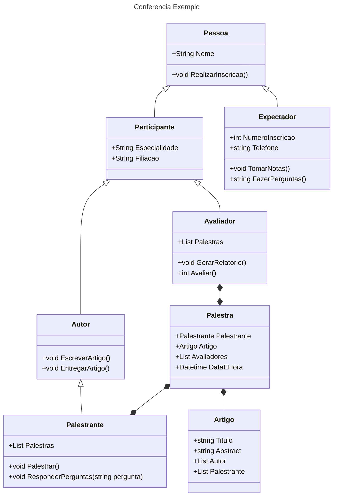

## Início Classes

```mermaid 
---
title: Conferencia Exemplo
---
classDiagram
    Pessoa <|-- Participante
    Participante <|-- Autor
    Autor <|-- Palestrante 
    Pessoa <|-- Expectador    
    Participante  <|-- Avaliador
    Avaliador *--* Palestra
    Palestra *--* Palestrante   
    Palestra *-- Artigo   

class Pessoa{
    +String Nome
    +void RealizarInscricao()
}

class Participante{
    +String Especialidade
    +String Filiacao
}

class Expectador{
    +int NumeroInscricao
    +string Telefone
    +void TomarNotas()
    +string FazerPerguntas()
}

class Avaliador{
    +List<Palestra> Palestras
    +void GerarRelatorio()
    +int Avaliar()
}

class Palestra{
    +Palestrante Palestrante
    +Artigo Artigo
    +List<Avaliador> Avaliadores
    +Datetime DataEHora
}

class Palestrante{
    +List<Palestra> Palestras
    +void Palestrar()
    +void ResponderPerguntas(string pergunta)
}

class Autor{
    +void EscreverArtigo()
    +void EntregarArtigo()
}

class Artigo{
    +string Titulo
    +string Abstract
    +List<Autor> Autor
    +List<Palestrante> Palestrante
}

```
**Diagrama 1** Conferência Científica
