## Node.JS - JavaScript no Servidor


### Pré-requisitos

```powershell	
npm install npm@latest
npm install -g npx
```


### Links interessantes:
- [Node.js Tutorial](https://www.w3schools.com/nodejs/default.asp)
- [Node.js](https://nodejs.org/en/)
- [Node.js - Download](https://nodejs.org/en/download/)
- [Node.JS no Visual Studio](https://visualstudio.microsoft.com/pt-br/vs/features/node-js/) 

- [Node.Js com SQLLite](https://www.linode.com/docs/guides/getting-started-with-nodejs-sqlite/)


### Início Rápido

1 - No visual Studio crie um novo projeto Node.js


2 - Configure o eslint para o projeto
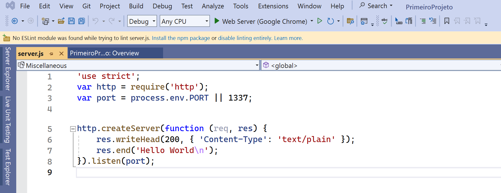

3 - Adicione o primeiro comando para correr do lado do servidor: 
```javascript
'use strict';
var http = require('http');
var port = process.env.PORT || 1337;

http.createServer(function (req, res) {
    res.writeHead(200, { 'Content-Type': 'text/plain' });
    res.end('Hello World\n');

}).listen(port);
```	

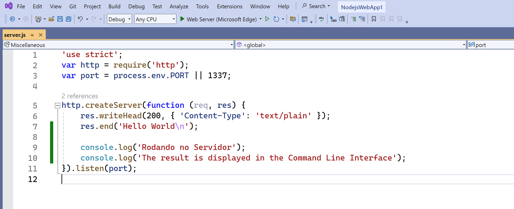


4 - Execute o projeto

5 - Adicione seu primeiro módulo
```javascript
exports.myDateTime = function () {
    return Date();
};
```
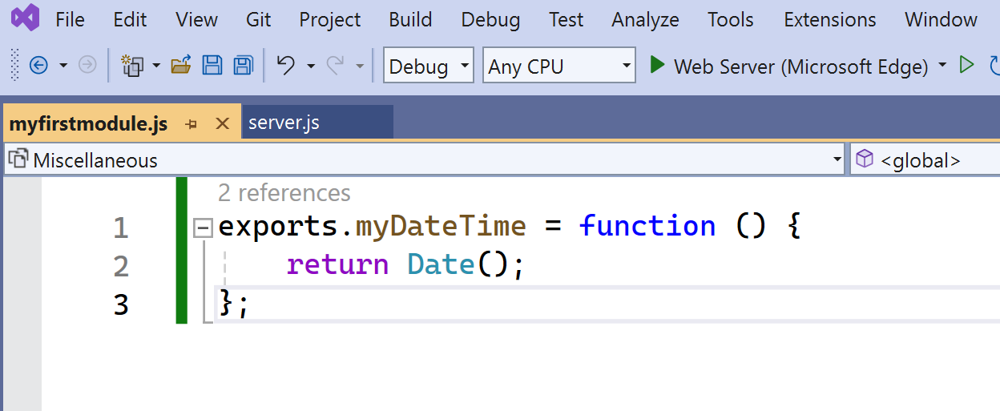

6 - Adicione o módulo ao projeto
```javascript
'use strict';
var http = require('http');
var port = process.env.PORT || 1337;
var dt = require('./myfirstmodule');

http.createServer(function (req, res) {
    res.writeHead(200, { 'Content-Type': 'text/html' });
    res.write("The date and time are currently: " + dt.myDateTime());
    res.end('Hello World!');

    console.log('Rodando no Servidor');
    console.log('The result is displayed in the Command Line Interface');
}).listen(port);
```	
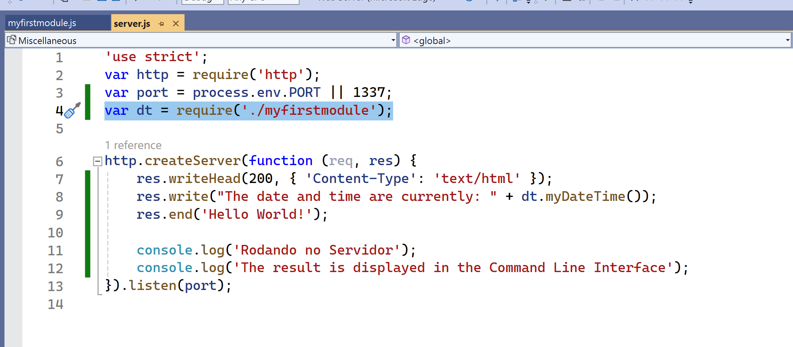

7 - Para recuperar a QueryString
```javascript
'use strict';
var http = require('http');
var port = process.env.PORT || 1337;
var dt = require('./myfirstmodule');

http.createServer(function (req, res) {
    res.writeHead(200, { 'Content-Type': 'text/html' });
    res.write("The date and time are currently: " + dt.myDateTime());
    console.log("Recuperar a Query String: " + req.url)

    res.end('Hello World!');

    console.log('Rodando no Servidor');
    console.log('The result is displayed in the Command Line Interface');
}).listen(port);
```
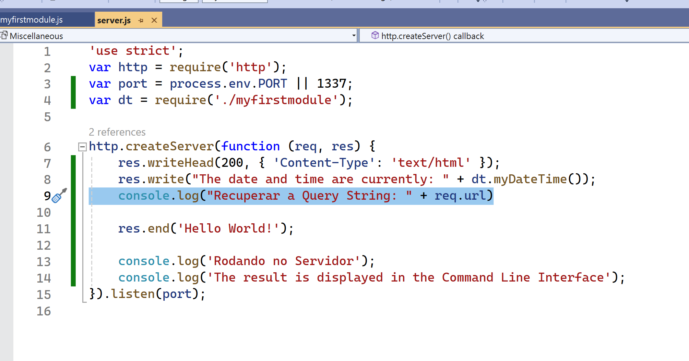


8 - Existem funções para recuperar partes da QueryString
```javascript
'use strict';
var http = require('http');
var port = process.env.PORT || 1337;
var dt = require('./myfirstmodule');
var url = require('url');

http.createServer(function (req, res) {
    res.writeHead(200, { 'Content-Type': 'text/html' });
    res.write("The date and time are currently: " + dt.myDateTime());
    res.end('Hello World!');

    var q = url.parse(req.url, true).query;
    var txt = q.year + " " + q.month;

    console.log("Recuperar a Query String: " + req.url)
    console.log('Rodando no Servidor');
    console.log('The result is displayed in the Command Line Interface');
}).listen(port);
```	
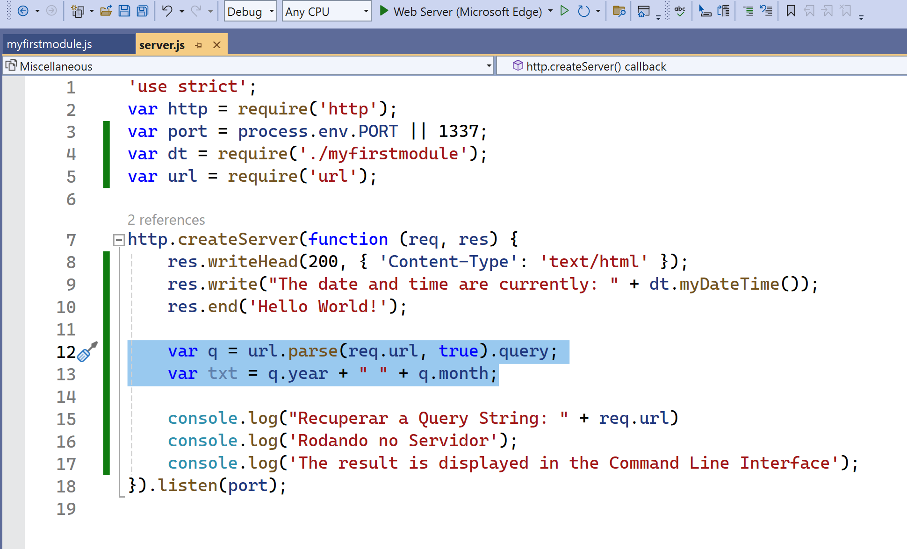


9 - Vamos aprender a ler arquivos
```javascript
'use strict';
var http = require('http');
var port = process.env.PORT || 1337;
var fs = require('fs');

http.createServer(function (req, res) {
    fs.readFile('demofile1.html', function (err, data) {
        res.writeHead(200, { 'Content-Type': 'text/html' });
        res.write(data);
        return res.end();
    });
}).listen(port);
```	

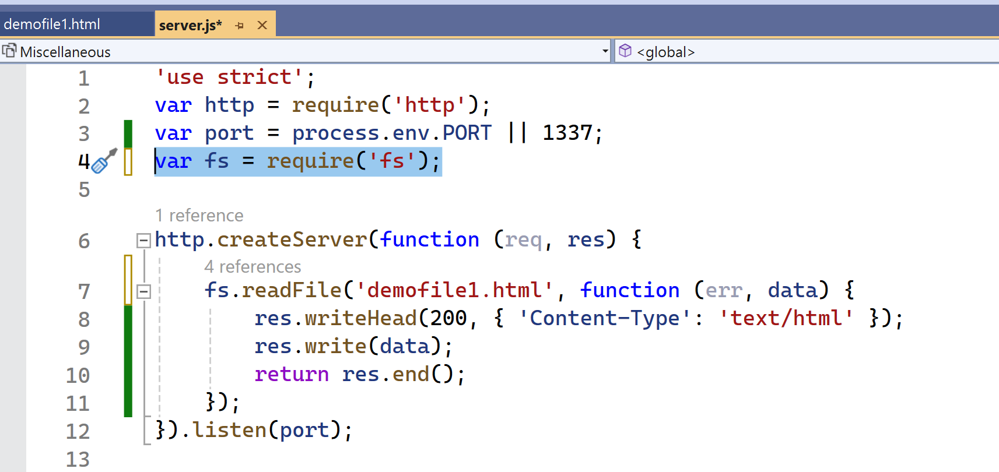

10 - Vamos aprender a atualizar arquivos
```javascript
'use strict';
var http = require('http');
var port = process.env.PORT || 1337;
var fs = require('fs');

http.createServer(function (req, res) {
    res.writeHead(200, { 'Content-Type': 'text/html' });

    fs.appendFile('mynewfile1.txt', 'Hello content!', function (err) {
        if (err) throw err;
        console.log('Saved!');
    });

    var data = fm.fileRead();
    res.writeHead(200, { 'Content-Type': 'text/html' });
    res.write(data);

}).listen(port);
```
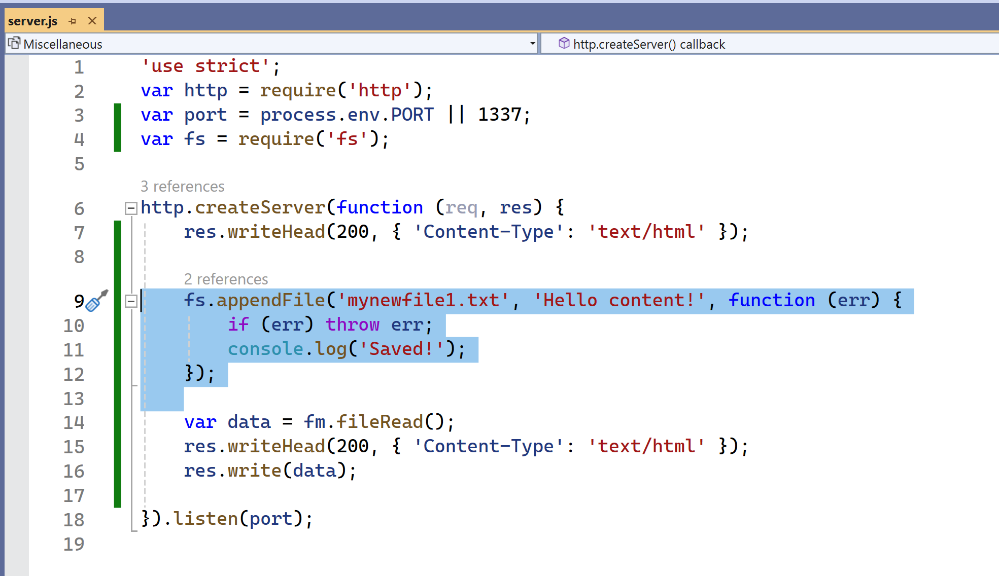

11 - Vamos aprender a substituir arquivos
```javascript
'use strict';
var http = require('http');
var port = process.env.PORT || 1337;
var fs = require('fs');

http.createServer(function (req, res) {
    res.writeHead(200, { 'Content-Type': 'text/html' });

    fs.writeFile('mynewfile3.txt', 'This is my text', function (err) {
        if (err) throw err;
        console.log('Replaced!');
    });
}).listen(port);
```
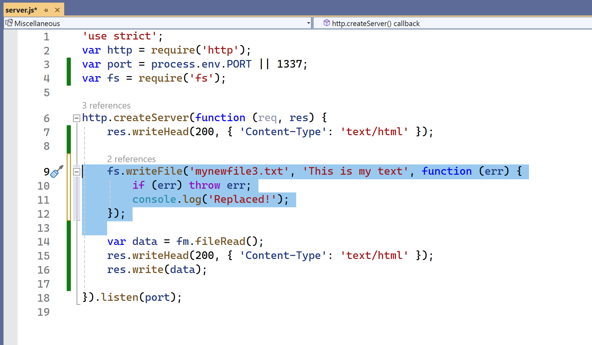

12 - Vamos aprender a excluir arquivos
```javascript
'use strict';
var http = require('http');
var port = process.env.PORT || 1337;
var fs = require('fs');

http.createServer(function (req, res) {
    res.writeHead(200, { 'Content-Type': 'text/html' });

    fs.unlink('mynewfile2.txt', function (err) {
        if (err) throw err;
        console.log('File deleted!');
    });

}).listen(port);

```
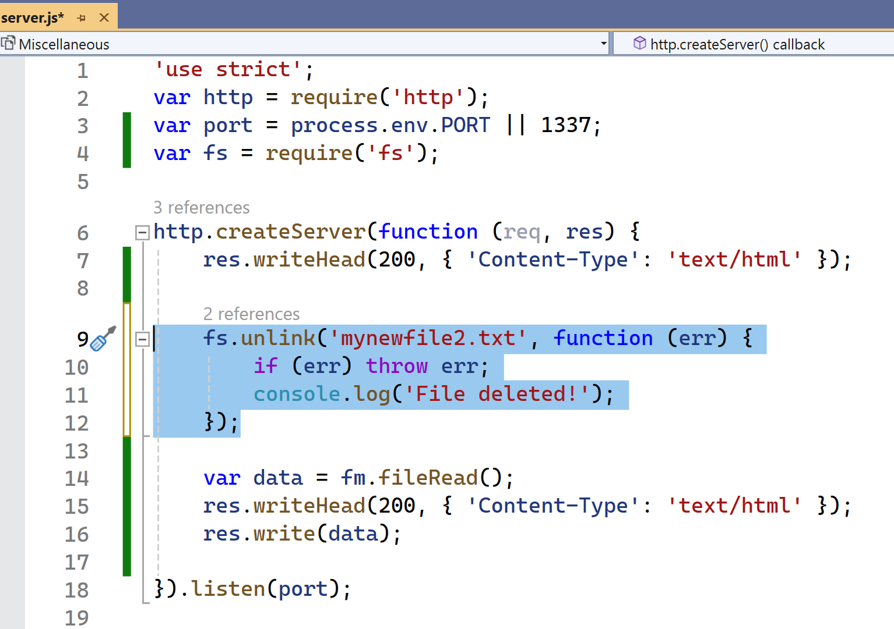

13 - Vamos aprender a renomear arquivos
```javascript
'use strict';
var http = require('http');
var port = process.env.PORT || 1337;
var fs = require('fs');

http.createServer(function (req, res) {
    res.writeHead(200, { 'Content-Type': 'text/html' });

    fs.rename('mynewfile1.txt', 'myrenamedfile.txt', function (err) {
        if (err) throw err;
        console.log('File Renamed!');
    });
    
}).listen(port);
```
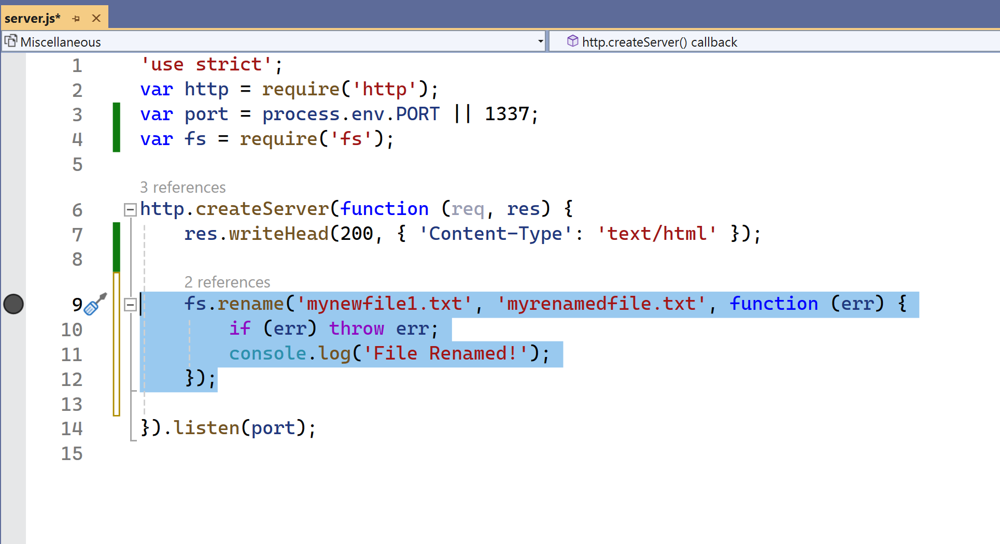

14 - o Módulo URL
```javascript	
'use strict';
var http = require('http');
var port = process.env.PORT || 1337;
var url = require('url');

http.createServer(function (req, res) {
    res.writeHead(200, { 'Content-Type': 'text/html' });

    //var adr = 'http://localhost:1337/default.htm?year=2017&month=february';
    var q = url.parse(req, true);

    console.log(q.host); //returns 'localhost:8080'
    console.log(q.pathname); //returns '/default.htm'
    console.log(q.search); //returns '?year=2017&month=february'

    var qdata = q.query; //returns an object: { year: 2017, month: 'february' }
    console.log(qdata.month); //returns 'february'
    
}).listen(port);
```
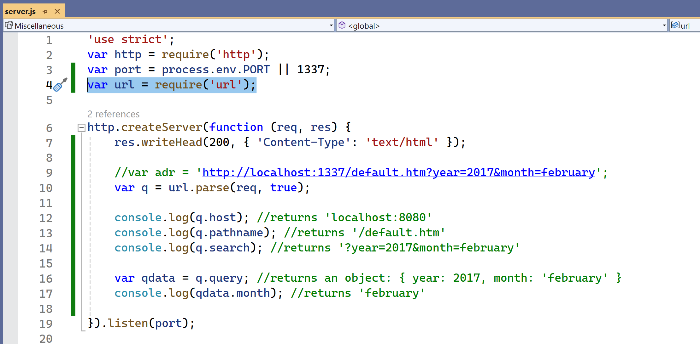

15 - Packages
O que é um package?
- Um package é um arquivo que contém um conjunto de arquivos que podem ser utilizados para criar um projeto.
- Um package pode conter:
    - Arquivos JavaScript
    - Arquivos CSS
    - Imagens
    - Dados
    - etc.
- Um package em Node.js contém todos os arquivos necessários para um módulo.
- Módulos são bibliotecas de funções que você pode incluir em seu projeto.

```PowerShell
npm install upper-case ignore
```

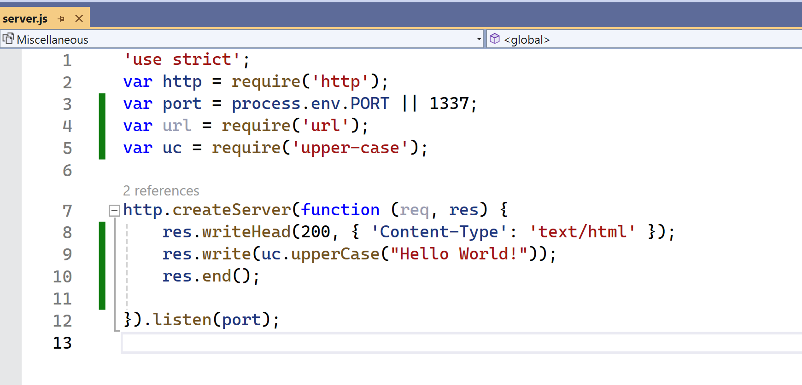

16 - Eventos em Node.js

Toda ação em um computador é um evento. Como quando uma conexão é estabelecida ou um arquivo é aberto.

Objetos no Node.js podem disparar eventos, como o objeto readStream dispara eventos ao abrir e fechar um arquivo:

```javascript
'use strict';
var http = require('http');
var port = process.env.PORT || 1337;
var fs = require('fs');

http.createServer(function (req, res) {

    var rs = fs.createReadStream('./demofile.txt');
    rs.on('open', function () {
        console.log('The file is open');
    });
}).listen(port);
```
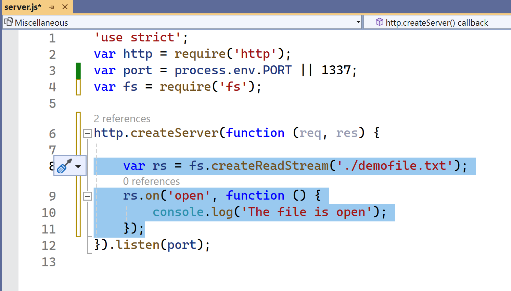


17 - O módulo Events

O Node.js possui um módulo embutido, chamado "Events", onde você pode criar, disparar e ouvir seus próprios eventos.

Para incluir o módulo Events embutido, utilize o método require(). Além disso, todas as propriedades e métodos de eventos são uma instância de um objeto EventEmitter. Para poder acessar essas propriedades e métodos, crie um objeto EventEmitter:

```javascript
'use strict';
var http = require('http');
var port = process.env.PORT || 1337;
var events = require('events');
var eventEmitter = new events.EventEmitter();


http.createServer(function (req, res) {


    //Assign the event handler to an event:
    eventEmitter.on('scream', myEventHandler);

    //Fire the 'scream' event:
    eventEmitter.emit('scream');

}).listen(port);


var myEventHandler = function () {
    console.log('I hear a scream!');
}
```

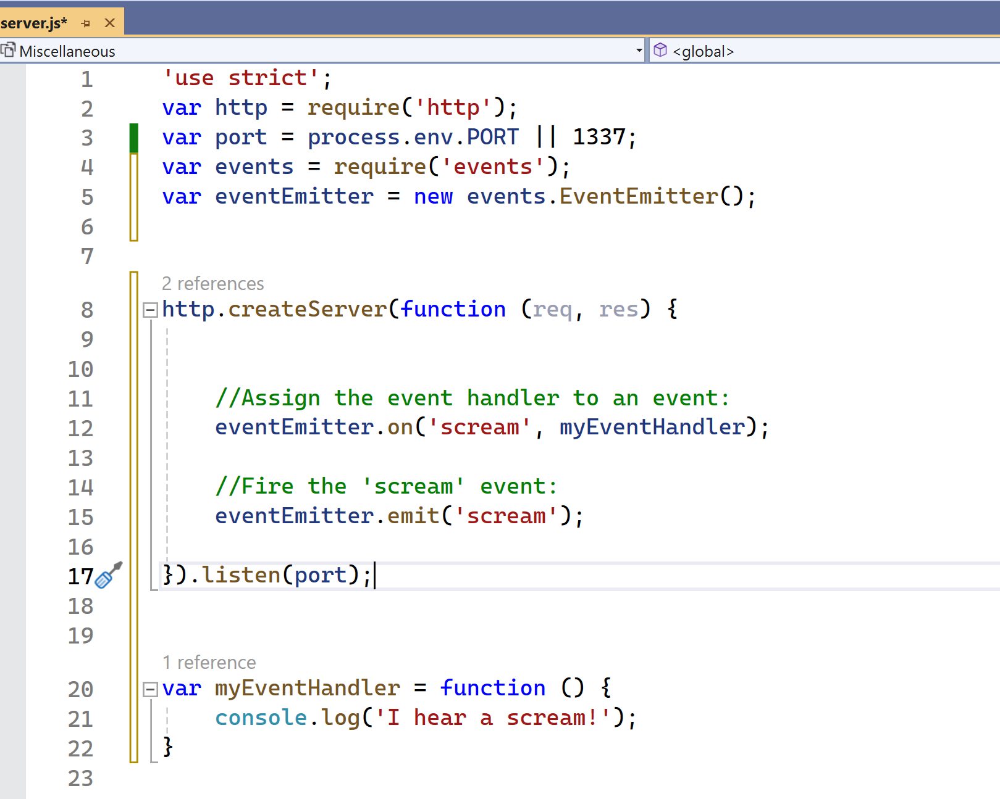


18 - Upload de arquivos

Há um módulo muito bom para trabalhar com uploads de arquivos, chamado "Formidable".

O módulo Formidable pode ser baixado e instalado usando o NPM:

```powershell
npm install formidable
```

Agora você pode incluir o módulo Formidable e começar a trabalhar com uploads de arquivos:

```javascript	
'use strict';
var http = require('http');
var port = process.env.PORT || 1337;
var formidable = require('formidable');
http.createServer(function (req, res) {

    if (req.url == '/fileupload') {
        var form = new formidable.IncomingForm();
        form.parse(req, function (err, fields, files) {
            var oldpath = files.filetoupload.filepath;
            var newpath = 'C:/Users/Your Name/' + files.filetoupload.originalFilename;
            fs.rename(oldpath, newpath, function (err) {
                if (err) throw err;
                res.write('File uploaded and moved!');
                res.end();
            });
        });
    } else {
        res.writeHead(200, { 'Content-Type': 'text/html' });
        res.write('<form action="fileupload" method="post" enctype="multipart/form-data">');
        res.write('<input type="file" name="filetoupload"><br>');
        res.write('<input type="submit">');
        res.write('</form>');
        return res.end();
    }

}).listen(port);
```

Explicando o que acontece no código acima:
18.1 - Crie um arquivo Node.js que escreva um formulário HTML, com um campo de upload

18.2 - Inclua o módulo Formidable para ser capaz de analisar o arquivo enviado assim que ele chegar ao servidor. 
Quando o arquivo é enviado e analisado, ele é colocado em uma pasta temporária no seu computador.

18.3 - Quando um arquivo é enviado com sucesso para o servidor, ele é colocado em uma pasta temporária.
O caminho para este diretório pode ser encontrado no objeto "files", passado como o terceiro argumento na função de retorno de chamada do método parse().
Para mover o arquivo para a pasta de sua escolha, use o módulo File System e renomeie o arquivo.

19 - Trabalhando com e-mails

O Node.js não possui um módulo embutido para enviar e-mails. Mas existem muitos módulos de terceiros que podem ser facilmente instalados com o NPM.

O módulo Nodemailer facilita o envio de e-mails a partir do seu computador.

O módulo Nodemailer pode ser baixado e instalado usando npm:

```powershell
npm install nodemailer
```

Agora você está pronto para enviar e-mails a partir do seu servidor.

Use o nome de usuário e a senha do seu provedor de e-mail selecionado para enviar um e-mail. Por xemplo, se você selecionar o Gmail, você precisará de um nome de usuário e senha do Gmail.

```javascript
'use strict';
var http = require('http');
var port = process.env.PORT || 1337;
var nodemailer = require('nodemailer');

http.createServer(function (req, res) {

    var transporter = nodemailer.createTransport({
        service: 'gmail',
        auth: {
            user: 'youremail@gmail.com',
            pass: 'yourpassword'
        }
    });

    var mailOptions = {
        from: 'youremail@gmail.com',
        to: 'myfriend@yahoo.com',
        subject: 'Sending Email using Node.js',
        text: 'That was easy!'
    };

    transporter.sendMail(mailOptions, function (error, info) {
        if (error) {
            console.log(error);
        } else {
            console.log('Email sent: ' + info.response);
        }
    });

}).listen(port);
```
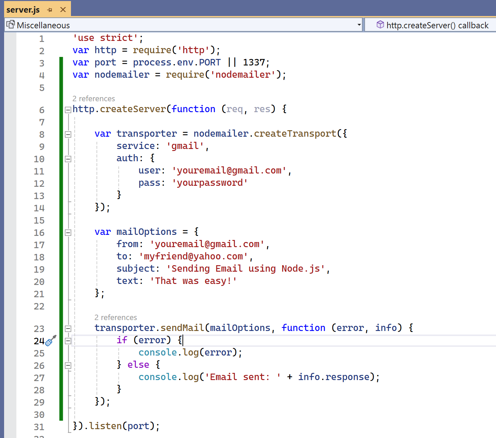


19 - Bônus: Trabalhando com SQLLite/MySQL

O Node.js pode ser usado para criar aplicativos de banco de dados.

https://medium.com/swlh/creating-a-crud-application-using-node-js-and-sqlite3-a57d4a39ab69 

https://www.w3schools.com/nodejs/nodejs_mysql.asp


# Creating a CRUD Application Using Node.js and SQLite3 | by Souvik Paul | The Startup | Medium

Hello world, welcome to the blog. Here we’ll create a simple application using Node.js that will perform basic CRUD operations (Create, Read, update, and Delete) on SQLite3 database on your local machine.

You can also find the entire project in my GitHub repository —

The basic outline of our project is shown below -

**Step 1:** First of all, make sure that you have Node.js and SQLite3 installed in your local machine. Then, open the terminal and create one directory which will be dedicated for our project. Navigate into that directory and run `npm init` . Then you will be asked to enter various details about your application, which will be stored as a json file named ‘Package.json’. Then you have to run — `npm install express --save` to install the ‘express’ module and — `npm install sqlite3 --save` to install ‘sqlite3’ module.

**Step 2:** Now, we’ll create our server application file with the name of ‘index.js’ in the same directory. Then we’ll open this file in any text editor like Visual studio code, Notepad, Notepad++, Sublime Text 3 etc and start writing the codes.

We’ll import all the necessary modules -

```
var sqlite3 = require('sqlite3').verbose();
var express = require('express');
var http = require('http');
```


Notice that the execution mode is set to verbose to produce long stack traces.

```
var app = express();
var server = http.createServer(app);
var db = new sqlite3.Database('./database/employee.db');
```


In the above code, we have created an instance of express, named ‘app’ and we have also created a database named ‘employee’ in the ‘database’ directory which is present in our current directory.

Then, we’ll create a table named ‘emp’ in the database having two columns- ‘id’ and ‘name’ using the following code -

```
db.run('CREATE TABLE IF NOT EXISTS emp(id TEXT, name TEXT)');
```


The above code will make sure that ‘emp’ table won’t be created again and again whenever we run the application.

**Step 3:** Now, it is the time to write the codes for listening to the GET requests made by the browser.

To make the user understand about the things he/she can do, we’ll display an introductory message on the browser when he/she enters `http://localhost:3000` .

```
app.get('/', function(req,res){
  res.send("<h3> Hi there, You are going to perform CRUD operations.............[CREATE] Please enter 'http://localhost:3000/add/(id number)/(name)' to add new employee to the database.........................[READ] 'http://localhost:3000/view/(id number)' to view an employee.........................[UPDATE] 'http://localhost:3000/update/(id number)/(new name)' to update an employee.....................[DELETE] 'http://localhost:3000/del/(id number)' to delete an employee...............................Before closing this window, kindly enter 'http://localhost:3000/close' to close the database connection <h3>");
});
```


The above code looks very big, but don’t worry there’s nothing much in it. The browser will display the above code as follows-

**CREATE**

To make a new entry in the ‘emp’ table, user must enter the URL which looks like this — `http://localhost:3000/add/(id number)/(name)` , where, ‘id number’ and ‘name’ can be anything that the user wants. So, to execute the user’s request, following code is responsible —

```
app.get('/add/:id/:name', function(req,res){
  db.serialize(()=>{
    db.run('INSERT INTO emp(id,name) VALUES(?,?)', [req.params.id, req.params.name], function(err) {
      if (err) {
        return console.log(err.message);
      }
      console.log("New employee has been added");
      res.send("New employee has been added into the database with ID = "+req.params.id+ " and Name = "+req.params.name);
    });});});
```


In the above code, the serialize() method puts the execution mode into serialized mode. It means that only one statement can execute at a time. Other statements will wait in a queue until all the previous statements are executed.

**READ**

To view any entry in the ‘emp’ table, the URL that the user needs to enter is — `http://localhost:3000/view/(id number)` , where ‘id number’ can be anything that the user wants to enter. So, the code mentioned below is responsible for execution of the user’s request -

```
app.get('/view/:id', function(req,res){
  db.serialize(()=>{
    db.each('SELECT id ID, name NAME FROM emp WHERE id =?', [req.params.id], function(err,row){     
      if(err){
        res.send("Error encountered while displaying");
        return console.error(err.message);
      }
      res.send(` ID: ${row.ID},    Name: ${row.NAME}`);
      console.log("Entry displayed successfully");
    });
  });
});
```


In the above code, the each() method executes an SQL query with specified parameters and calls a callback for every row in the result set.

**UPDATE**

To update any entry in the ‘emp’ table, the URL that the user needs to enter is — `http://localhost:3000/update/(id number)/(new name)` , where ‘id number’ and ‘new name’ can be anything that the user wants to enter. So, the code mentioned below is responsible for execution of the user’s request -

```
app.get('/update/:id/:name', function(req,res){
  db.serialize(()=>{
    db.run('UPDATE emp SET name = ? WHERE id = ?', [req.params.name,req.params.id], function(err){
      if(err){
        res.send("Error encountered while updating");
        return console.error(err.message);
      }
      res.send("Entry updated successfully");
      console.log("Entry updated successfully");
    });
  });
});
```


The above code will change the name of the employee corresponding to the specified ‘id number’.

**DELETE**

To delete any entry in the ‘emp’ table, the format of the URL should be — `http://localhost:3000/del/(id number)` . For this, the code is as follows -

```
app.get('/del/:id', function(req,res){
  db.serialize(()=>{
    db.run('DELETE FROM emp WHERE id = ?', req.params.id, function(err) {
      if (err) {
        res.send("Error encountered while deleting");
        return console.error(err.message);
      }
      res.send("Entry deleted");
      console.log("Entry deleted");
    });
  });});
```


**Step 4:** Now that we have written the codes for the basic CRUD operations, we’ll now write the code for closing the database as we have opened it in Step 2. For this, we have already displayed in the introductory message in Step 3, that the user needs to enter `http://localhost:3000/close` to close the database connection. So, the code that will execute this request will be -

```
app.get('/close', function(req,res){
  db.close((err) => {
    if (err) {
      res.send('There is some error in closing the database');
      return console.error(err.message);
    }
    console.log('Closing the database connection.');
    res.send('Database connection successfully closed');
  });});
```


**Step 5:** Now, we need to make our server application listen to all the requests made by the browser, which will be achieved by the following command-

```
server.listen(3000,function(){ 
    console.log("Server listening on port: 3000");
});
```


**Step 6:** Now that we have written all the codes for our server application, we’ll save it and go back to terminal to run this using the command `node index.js`. The following message will be displayed in the console -

```
Server listening on port: 3000
```


So, now our server is up and running. We will open the browser and enter `http://localhost:3000` to start doing the CRUD operations.


Criando uma API RESTful com NodeJS e Express — Inicializando o projeto e o método GET
=====================================================================================

[Link](https://medium.com/xp-inc/https-medium-com-tiago-jlima-developer-criando-uma-api-restful-com-nodejs-e-express-9cc1a2c9d4d8)


Sabemos que a linguagem Javascript se tornou uma das mais importantes do mundo, podemos codar em vários lugares como no Arduino/Raspberry, Data Science, Machine Learning, Chatbots, entre outros… Então porque não usá-lo para criar nossa API RESTful 🤟.

*   **REST:** conjunto de princípios de arquitetura
*   **RESTful:** capacidade de determinado sistema aplicar os princípios de REST.

Bom, primeiramente precisamos de uma plataforma de desenvolvimento server-side e de um motor Javascript, então usaremos o NodeJS e o poderoso motor V8, e para nos auxiliar na entrega da nossa API usaremos o [Express](http://expressjs.com/pt-br/) um dos frameworks mais utilizados 😍.

Lista de motores Javascript
===========================

*   [V8](https://en.wikipedia.org/wiki/V8_%28JavaScript_engine%29) — open source, desenvolvido pelo Google, escrito em C++
*   [Rhin](https://en.wikipedia.org/wiki/Rhino_%28JavaScript_engine%29)o — gerenciado pela Mozilla Foundation, open source, desenvolvido inteiramente em Java
*   [SpiderMonkey](https://en.wikipedia.org/wiki/SpiderMonkey_%28JavaScript_engine%29) — a primeira engine Javascript, que um dia empoderou o Netscape Navigator, e hoje empodera o Firefox
*   [JavaScriptCore](https://en.wikipedia.org/wiki/JavaScriptCore) — open source, comercializado como Nitro desenvolvido pela Apple para o Safari
*   [KJS](https://en.wikipedia.org/wiki/KJS_%28KDE%29) — KDE’s engine originalmente desenvolvido por Harri Porten para o projeto KDE Konqueror web browser
*   [Chakra (JScript9)](https://en.wikipedia.org/wiki/Chakra_%28JScript_engine%29) — Internet Explorer
*   [Chakra (JavaScript)](https://en.wikipedia.org/wiki/Chakra_%28JavaScript_engine%29) — Microsoft Edge
*   [Nashorn](https://en.wikipedia.org/wiki/Nashorn_%28JavaScript_engine%29), open source como parte do OpenJDK, escrito pela Oracle Java Languages e Tool Group
*   [JerryScript](https://en.wikipedia.org/wiki/JerryScript) — é uma engine leve para a internet das coisas(IOT).

Configurando nosso ambiente
===========================

**Windows:** Vamos baixar e instalar o [NodeJS](https://nodejs.org/en/download/) que virá junto com o package manager, mais conhecido como NPM, e seguir a instalação com “next” “next”, neste momento instalei a versão: v10_.16.0._

> Dica: podemos gerenciar as versões do NodeJS com o [NVM](https://github.com/nvm-sh/nvm), farei um artigo sobre.

Abra seu terminal e verifique se foi instalado, eu uso o [**cmder**](https://cmder.net) no windows**,** muito top.

$ node -v && npm -v  
v10.16.0  
6.10.3

**Linux:**

Baixar o binário [https://nodejs.org/en/download/](https://nodejs.org/en/download/).

Extrair o pacote em um novo diretório: `/usr/local/lib/node`

sudo mkdir -p /usr/local/lib/node  
sudo tar -xJvf node-$VERSION-$DISTRO.tar.xz -C /usr/local/lib/nodejs

Setar variável de ambiente no`~/.profile`

\# Nodejs  
export PATH=/usr/local/lib/nodejs/node-$VERSION-$DISTRO/bin:$PATH

Atualizar profile

. ~/.profile

Testar instalação

$ node -v && npm -v

**Mac OSX:**

$ brew install node

Criando nossa estrutura
=======================

Inicialmente vamos criar o nosso package.json, ele é responsável por descrever nosso projeto, informando engines, scripts de ambientes, e outras coisas...

$ npm init -y

Agora criaremos nossa estrutura de pastas.

./api/ => Contém nosso código da api.  
./api/controllers/ => Contém todos controladores da api.  
./api/data/ => Contém nossos mocks.  
./api/routes/ => Contém as rotas da api.  
./config/ => Contém as configurações do servidor.  
./package.json => Listagem das dependências do projeto.

Além do Express vamos precisar de alguns pacotes para nos auxiliar.

Nodemon
=======

Toda vez que alterarmos os arquivos da aplicação teremos que derrubar e subir novamente, isso não é muito produtivo não é?, então vamos usar o [nodemon](https://nodemon.io/) para monitorar os ajustes e restartar o nosso servidor.

> \*Importante: Usem o nodemon somente em dev, em produção existem outros pacotes como [PM2](https://pm2.keymetrics.io/), [Forever](https://www.npmjs.com/package/forever), criarei um post sobre PM2 e Forever.

> Dica: para restartar a aplicação com nodemon ligado no terminal, é só digitar “rs”.

Body Parser
===========

NodeJS em si não sabe converter os dados da requisição para o formato que queremos, o [body-parser](https://www.npmjs.com/package/body-parser) é um middleware capaz de converter o _body_ da requisição para vários formatos. Um desses formatos é _json_, exatamente o que queremos.

Config
======

Toda vez que tivermos que mudar alguma variável de ambiente porque nosso cliente pediu, teremos que alterar em vários arquivos. Este pacote [config](https://www.npmjs.com/package/config) nos permite organizar a configuração da nossa aplicação e estender em qualquer arquivo.

Vamos instalar os pacotes e o nosso queridinho [Express](https://expressjs.com/pt-br/), utilizaremos as versões fixas para termos o projeto igual.

$ npm i -g [\[email protected\]](/cdn-cgi/l/email-protection) && npm i --save [\[email protected\]](/cdn-cgi/l/email-protection) && npm i --save [\[email protected\]](/cdn-cgi/l/email-protection) && npm i --save [\[email protected\]](/cdn-cgi/l/email-protection)

> Dica: a flag “_i”_ _significa “install” e o “— save” para gravar o pacote no nosso arquivo package.json._

Agora vamos criar nosso principal arquivo de configuração da nossa aplicação dentro da pasta **“**./config/**default.json”,** é neste arquivo que estará as configurações de ambientes, banco de dados, autenticação...

Agora vamos configurar nossa aplicação Express, criaremos nosso arquivo dentro da pasta **“**./config/**express.js”**.

Pronto, agora vamos criar nosso arquivo que inicia o servidor dentro da pasta raiz do projeto **“**./**server.js”**.

Agora vamos subir nosso servidor com nodemon + o nome do arquivo “./server.js” 🙌

$ nodemon server.js

Vocês devem estar pensando “Poh liminhaaaa, mas não tem um jeito melhor de subir nosso servidor sem precisar colocar o nome do arquivo inicial”, e a resposta é sim! 😅

Lembra do nosso arquivo “./**package.json”**, pois é, é nele que vamos criar nossos scripts, então vamos criar o nosso primeiro script de start da nossa aplicação com nodemon.

Agora vamos iniciar nosso servidor.

$ npm start

> Dica: para derrubar aplicação no terminal pressionem “CTRL+C”.

Resultado.

Pronto, temos nosso servidor rodando na porta 8080, só que ao acessar o endereço: [http://localhost:8080/](http://localhost:8080/) deve retornar **“Cannot GET /”**, então vamos criar nossa primeira rota

Criaremos a “/customer-wallets” do tipo GET, então vamos lá

*   ./api/data**/customerWallets.json** \=> mock
*   ./api/controllers**/customerWallets.js** \=> controller
*   ./api/routes**/customerWallets.js** \=> router

Primeiro precisamos dos dados, então vamos iniciar mock, dentro do arquivo ./api/data**/customerWallets.json.**

Agora vamos configurar nosso controller da rota “./api/controller**/customerWallets.js”**

Agora vamos configurar a rota “./api/routes**/customerWallets.js”**

Na linha 1 receberemos nosso app express e usaremos para criar nossa rota na linha 4, na linha 2 importamos nosso controller.

Pronto, agora temos que consumir essa rota, então vamos importar na configuração do express “./config/**express.js”**

Perceba que ao importar a rota na linha 7, temos que passar o app(express).

Pronto, agora vamos usar o [Postman](https://www.getpostman.com/) para consumir nossa rota “/api/v1/customer-wallets” do tipo GET.

Poh muito top Liminhaa, mas toda rota nova, tem que importar no express? isso é pouco produtivo né, existe algo automágico que faça os imports**? Sim meu jovenzinhoooo, existe!** 🤩

Consign
=======

Pois é, ter que importar nossas rotas, controllers, models é pouco produtivo, então o [consign](https://www.npmjs.com/package/consign) nos ajuda detectando e importando na nossa aplicação Express, então vamos instalar.

$ npm i [\[email protected\]](/cdn-cgi/l/email-protection) --save

Agora vamos configurar nossa aplicação, vamos abrir o arquivo “./config/**express.js”.**

Agora vamos alterar os arquivos para seguir o novo tipo de import. Vamos começar pelo arquivo “./api/routes/**customerWallets.js”.**

Percebam que na linha 2, como iremos importar a partir de agora, “app/nome\_pasta/arquivo”.

Agora vamos alterar o controller “./api/controllers/**customerWallets.js”.**

Importante, agora temos que injetar o “app” dentro do nosso controller

Na linha 2 importamos o nosso mock “app/nome\_pasta/arquivo”.

Agora sim, temos uma aplicação mais produtiva e o legal é que agora se parece com importação com namespaces, segue resultado.

Meus jovenzinhos, por enquanto é isso, nos próximos artigos iremos implementar os outros métodos POST, PUT, PATCH, DELETE, conectar com MongoDB, Autenticação com JWT e muito mais… espero que gostem.

Segue link do projeto [Github](https://github.com/TL-Developer/API_RESTFul_NODEJS) e vamos evoluindo.

Até a próxima galera, um abração.
