## Node.JS - JavaScript no Servidor


### Pré-requisitos

```powershell	
npm install npm@latest
npm install -g npx
```


### Links interessantes:
- [Node.js Tutorial](https://www.w3schools.com/nodejs/default.asp)
- [Node.js](https://nodejs.org/en/)
- [Node.js - Download](https://nodejs.org/en/download/)
- [Node.JS no Visual Studio](https://visualstudio.microsoft.com/pt-br/vs/features/node-js/) 

- [Node.Js com SQLLite](https://www.linode.com/docs/guides/getting-started-with-nodejs-sqlite/)


### Início Rápido

1 - No visual Studio crie um novo projeto Node.js
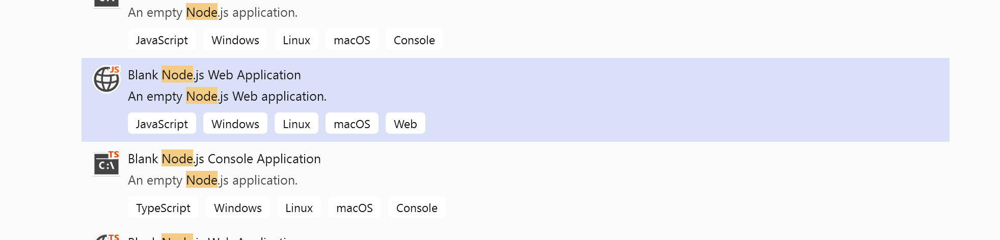


2 - Configure o eslint para o projeto
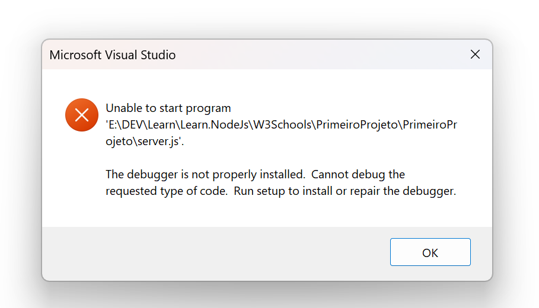

3 - Adicione o primeiro comando para correr do lado do servidor: 
```javascript
'use strict';
var http = require('http');
var port = process.env.PORT || 1337;

http.createServer(function (req, res) {
    res.writeHead(200, { 'Content-Type': 'text/plain' });
    res.end('Hello World\n');

}).listen(port);
```	

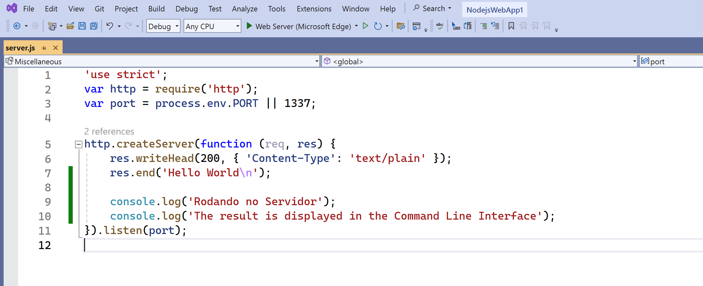


4 - Execute o projeto

5 - Adicione seu primeiro módulo
```javascript
exports.myDateTime = function () {
    return Date();
};
```
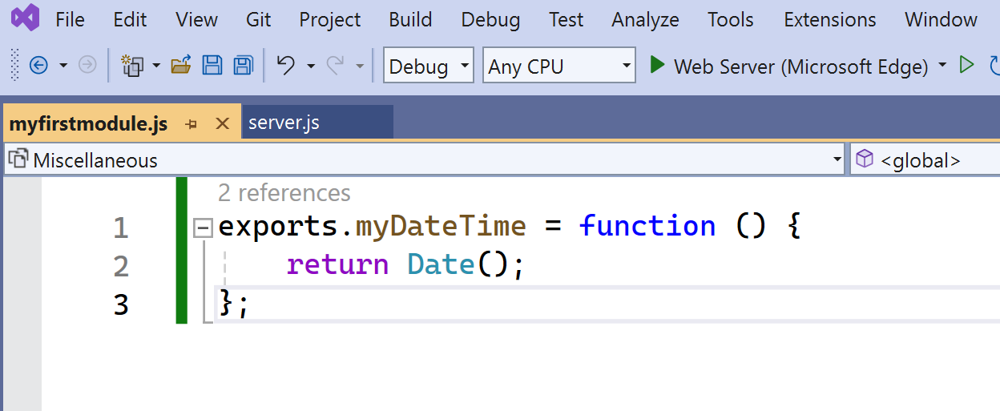

6 - Adicione o módulo ao projeto
```javascript
'use strict';
var http = require('http');
var port = process.env.PORT || 1337;
var dt = require('./myfirstmodule');

http.createServer(function (req, res) {
    res.writeHead(200, { 'Content-Type': 'text/html' });
    res.write("The date and time are currently: " + dt.myDateTime());
    res.end('Hello World!');

    console.log('Rodando no Servidor');
    console.log('The result is displayed in the Command Line Interface');
}).listen(port);
```	
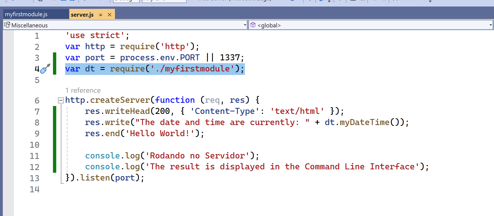

7 - Para recuperar a QueryString
```javascript
'use strict';
var http = require('http');
var port = process.env.PORT || 1337;
var dt = require('./myfirstmodule');

http.createServer(function (req, res) {
    res.writeHead(200, { 'Content-Type': 'text/html' });
    res.write("The date and time are currently: " + dt.myDateTime());
    console.log("Recuperar a Query String: " + req.url)

    res.end('Hello World!');

    console.log('Rodando no Servidor');
    console.log('The result is displayed in the Command Line Interface');
}).listen(port);
```
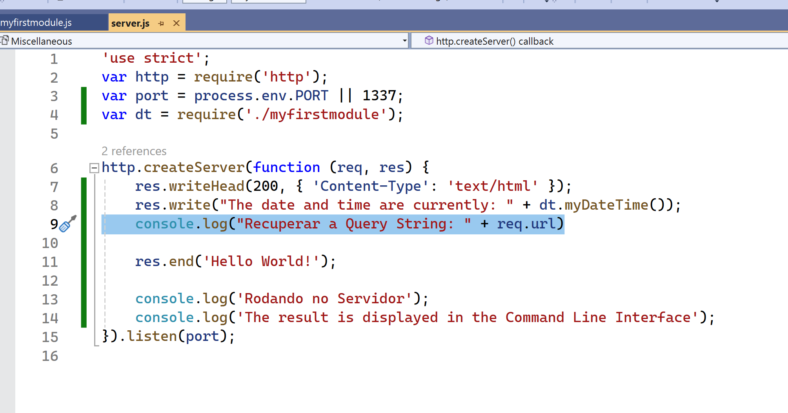


8 - Existem funções para recuperar partes da QueryString
```javascript
'use strict';
var http = require('http');
var port = process.env.PORT || 1337;
var dt = require('./myfirstmodule');
var url = require('url');

http.createServer(function (req, res) {
    res.writeHead(200, { 'Content-Type': 'text/html' });
    res.write("The date and time are currently: " + dt.myDateTime());
    res.end('Hello World!');

    var q = url.parse(req.url, true).query;
    var txt = q.year + " " + q.month;

    console.log("Recuperar a Query String: " + req.url)
    console.log('Rodando no Servidor');
    console.log('The result is displayed in the Command Line Interface');
}).listen(port);
```	
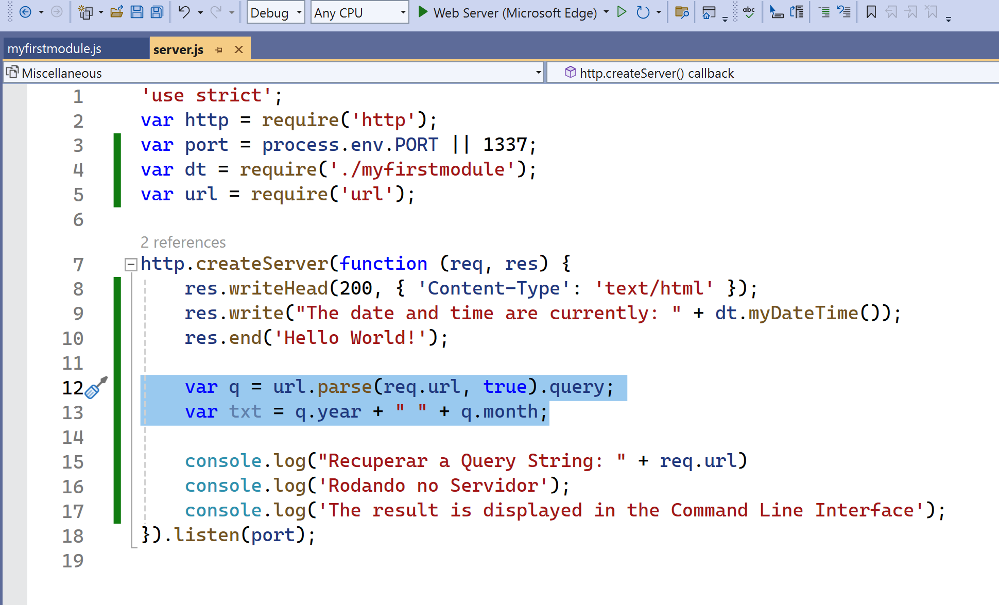


9 - Vamos aprender a ler arquivos
```javascript
'use strict';
var http = require('http');
var port = process.env.PORT || 1337;
var fs = require('fs');

http.createServer(function (req, res) {
    fs.readFile('demofile1.html', function (err, data) {
        res.writeHead(200, { 'Content-Type': 'text/html' });
        res.write(data);
        return res.end();
    });
}).listen(port);
```	

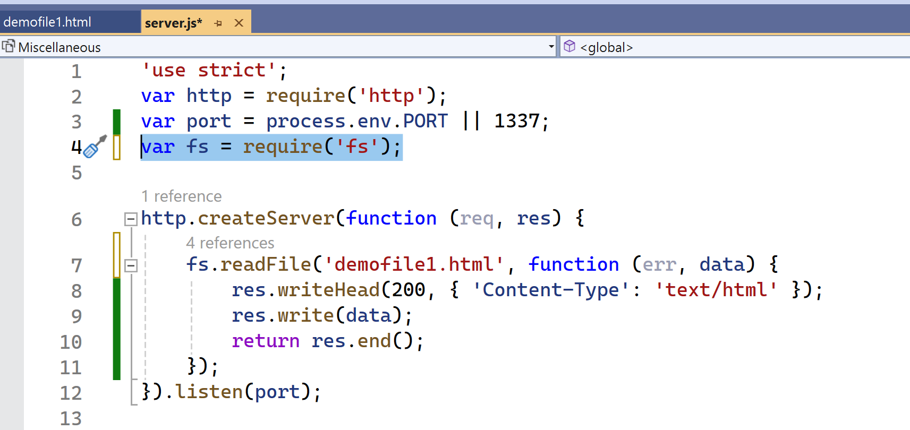

10 - Vamos aprender a atualizar arquivos
```javascript
'use strict';
var http = require('http');
var port = process.env.PORT || 1337;
var fs = require('fs');

http.createServer(function (req, res) {
    res.writeHead(200, { 'Content-Type': 'text/html' });

    fs.appendFile('mynewfile1.txt', 'Hello content!', function (err) {
        if (err) throw err;
        console.log('Saved!');
    });

    var data = fm.fileRead();
    res.writeHead(200, { 'Content-Type': 'text/html' });
    res.write(data);

}).listen(port);
```
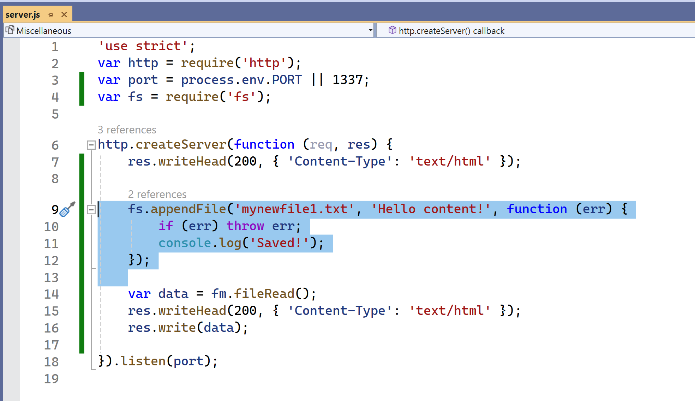

11 - Vamos aprender a substituir arquivos
```javascript
'use strict';
var http = require('http');
var port = process.env.PORT || 1337;
var fs = require('fs');

http.createServer(function (req, res) {
    res.writeHead(200, { 'Content-Type': 'text/html' });

    fs.writeFile('mynewfile3.txt', 'This is my text', function (err) {
        if (err) throw err;
        console.log('Replaced!');
    });
}).listen(port);
```
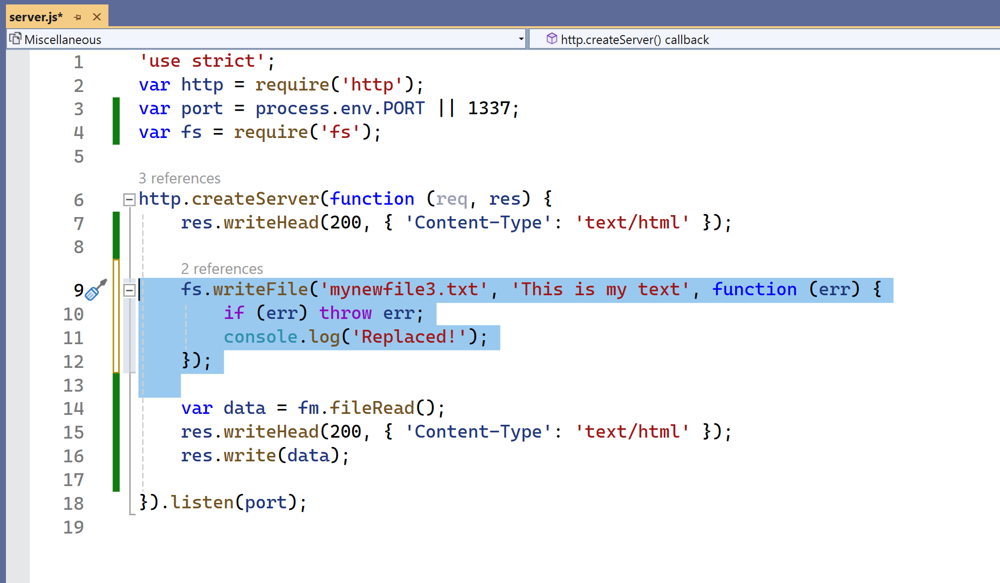

12 - Vamos aprender a excluir arquivos
```javascript
'use strict';
var http = require('http');
var port = process.env.PORT || 1337;
var fs = require('fs');

http.createServer(function (req, res) {
    res.writeHead(200, { 'Content-Type': 'text/html' });

    fs.unlink('mynewfile2.txt', function (err) {
        if (err) throw err;
        console.log('File deleted!');
    });

}).listen(port);

```
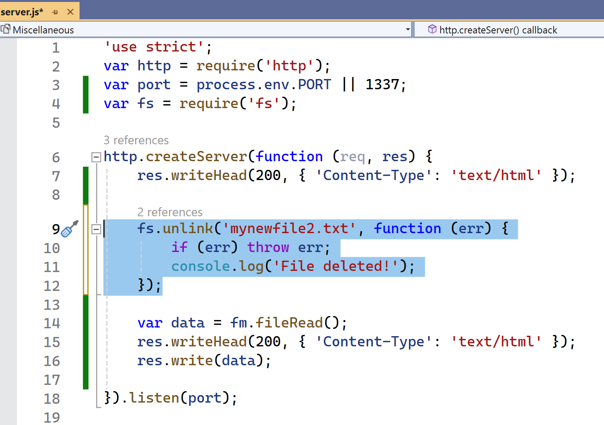

13 - Vamos aprender a renomear arquivos
```javascript
'use strict';
var http = require('http');
var port = process.env.PORT || 1337;
var fs = require('fs');

http.createServer(function (req, res) {
    res.writeHead(200, { 'Content-Type': 'text/html' });

    fs.rename('mynewfile1.txt', 'myrenamedfile.txt', function (err) {
        if (err) throw err;
        console.log('File Renamed!');
    });
    
}).listen(port);
```
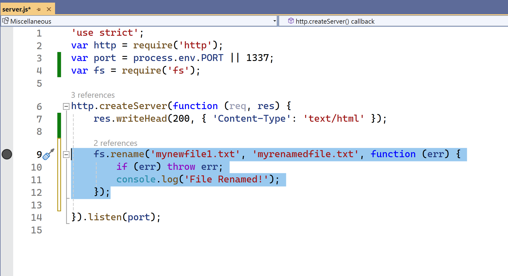

14 - o Módulo URL
```javascript	
'use strict';
var http = require('http');
var port = process.env.PORT || 1337;
var url = require('url');

http.createServer(function (req, res) {
    res.writeHead(200, { 'Content-Type': 'text/html' });

    //var adr = 'http://localhost:1337/default.htm?year=2017&month=february';
    var q = url.parse(req, true);

    console.log(q.host); //returns 'localhost:8080'
    console.log(q.pathname); //returns '/default.htm'
    console.log(q.search); //returns '?year=2017&month=february'

    var qdata = q.query; //returns an object: { year: 2017, month: 'february' }
    console.log(qdata.month); //returns 'february'
    
}).listen(port);
```
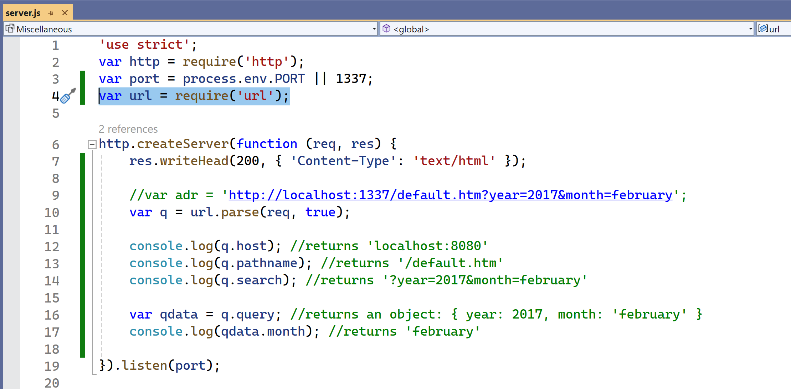

15 - Packages
O que é um package?
- Um package é um arquivo que contém um conjunto de arquivos que podem ser utilizados para criar um projeto.
- Um package pode conter:
    - Arquivos JavaScript
    - Arquivos CSS
    - Imagens
    - Dados
    - etc.
- Um package em Node.js contém todos os arquivos necessários para um módulo.
- Módulos são bibliotecas de funções que você pode incluir em seu projeto.

```PowerShell
npm install upper-case ignore
```

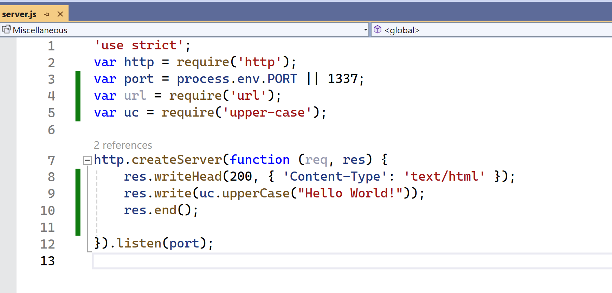

16 - Eventos em Node.js

Toda ação em um computador é um evento. Como quando uma conexão é estabelecida ou um arquivo é aberto.

Objetos no Node.js podem disparar eventos, como o objeto readStream dispara eventos ao abrir e fechar um arquivo:

```javascript
'use strict';
var http = require('http');
var port = process.env.PORT || 1337;
var fs = require('fs');

http.createServer(function (req, res) {

    var rs = fs.createReadStream('./demofile.txt');
    rs.on('open', function () {
        console.log('The file is open');
    });
}).listen(port);
```
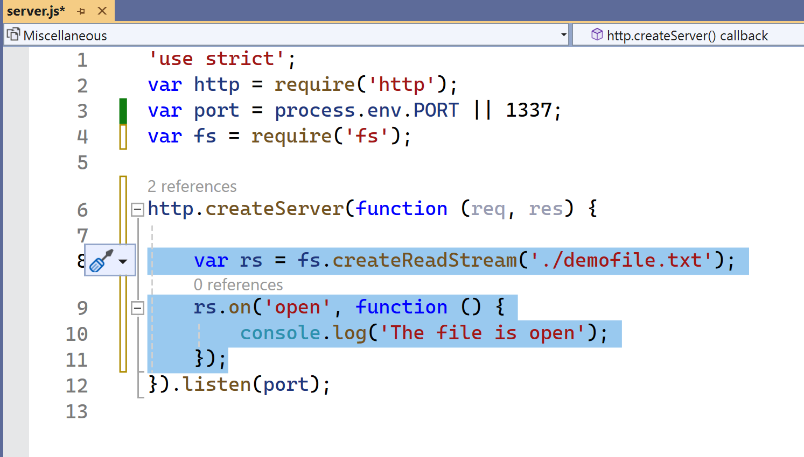


17 - O módulo Events

O Node.js possui um módulo embutido, chamado "Events", onde você pode criar, disparar e ouvir seus próprios eventos.

Para incluir o módulo Events embutido, utilize o método require(). Além disso, todas as propriedades e métodos de eventos são uma instância de um objeto EventEmitter. Para poder acessar essas propriedades e métodos, crie um objeto EventEmitter:

```javascript
'use strict';
var http = require('http');
var port = process.env.PORT || 1337;
var events = require('events');
var eventEmitter = new events.EventEmitter();


http.createServer(function (req, res) {


    //Assign the event handler to an event:
    eventEmitter.on('scream', myEventHandler);

    //Fire the 'scream' event:
    eventEmitter.emit('scream');

}).listen(port);


var myEventHandler = function () {
    console.log('I hear a scream!');
}
```

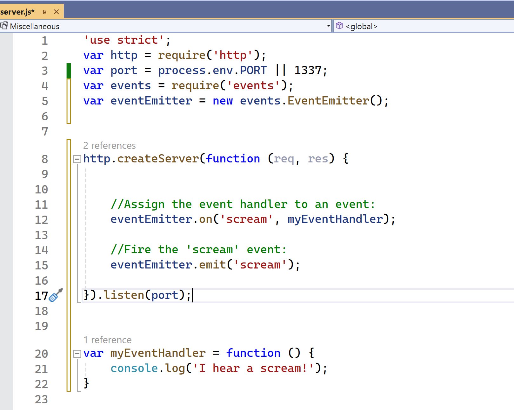


18 - Upload de arquivos

Há um módulo muito bom para trabalhar com uploads de arquivos, chamado "Formidable".

O módulo Formidable pode ser baixado e instalado usando o NPM:

```powershell
npm install formidable
```

Agora você pode incluir o módulo Formidable e começar a trabalhar com uploads de arquivos:

```javascript	
'use strict';
var http = require('http');
var port = process.env.PORT || 1337;
var formidable = require('formidable');
http.createServer(function (req, res) {

    if (req.url == '/fileupload') {
        var form = new formidable.IncomingForm();
        form.parse(req, function (err, fields, files) {
            var oldpath = files.filetoupload.filepath;
            var newpath = 'C:/Users/Your Name/' + files.filetoupload.originalFilename;
            fs.rename(oldpath, newpath, function (err) {
                if (err) throw err;
                res.write('File uploaded and moved!');
                res.end();
            });
        });
    } else {
        res.writeHead(200, { 'Content-Type': 'text/html' });
        res.write('<form action="fileupload" method="post" enctype="multipart/form-data">');
        res.write('<input type="file" name="filetoupload"><br>');
        res.write('<input type="submit">');
        res.write('</form>');
        return res.end();
    }

}).listen(port);
```

Explicando o que acontece no código acima:
18.1 - Crie um arquivo Node.js que escreva um formulário HTML, com um campo de upload

18.2 - Inclua o módulo Formidable para ser capaz de analisar o arquivo enviado assim que ele chegar ao servidor. 
Quando o arquivo é enviado e analisado, ele é colocado em uma pasta temporária no seu computador.

18.3 - Quando um arquivo é enviado com sucesso para o servidor, ele é colocado em uma pasta temporária.
O caminho para este diretório pode ser encontrado no objeto "files", passado como o terceiro argumento na função de retorno de chamada do método parse().
Para mover o arquivo para a pasta de sua escolha, use o módulo File System e renomeie o arquivo.

19 - Trabalhando com e-mails

O Node.js não possui um módulo embutido para enviar e-mails. Mas existem muitos módulos de terceiros que podem ser facilmente instalados com o NPM.

O módulo Nodemailer facilita o envio de e-mails a partir do seu computador.

O módulo Nodemailer pode ser baixado e instalado usando npm:

```powershell
npm install nodemailer
```

Agora você está pronto para enviar e-mails a partir do seu servidor.

Use o nome de usuário e a senha do seu provedor de e-mail selecionado para enviar um e-mail. Por xemplo, se você selecionar o Gmail, você precisará de um nome de usuário e senha do Gmail.

```javascript
'use strict';
var http = require('http');
var port = process.env.PORT || 1337;
var nodemailer = require('nodemailer');

http.createServer(function (req, res) {

    var transporter = nodemailer.createTransport({
        service: 'gmail',
        auth: {
            user: 'youremail@gmail.com',
            pass: 'yourpassword'
        }
    });

    var mailOptions = {
        from: 'youremail@gmail.com',
        to: 'myfriend@yahoo.com',
        subject: 'Sending Email using Node.js',
        text: 'That was easy!'
    };

    transporter.sendMail(mailOptions, function (error, info) {
        if (error) {
            console.log(error);
        } else {
            console.log('Email sent: ' + info.response);
        }
    });

}).listen(port);
```
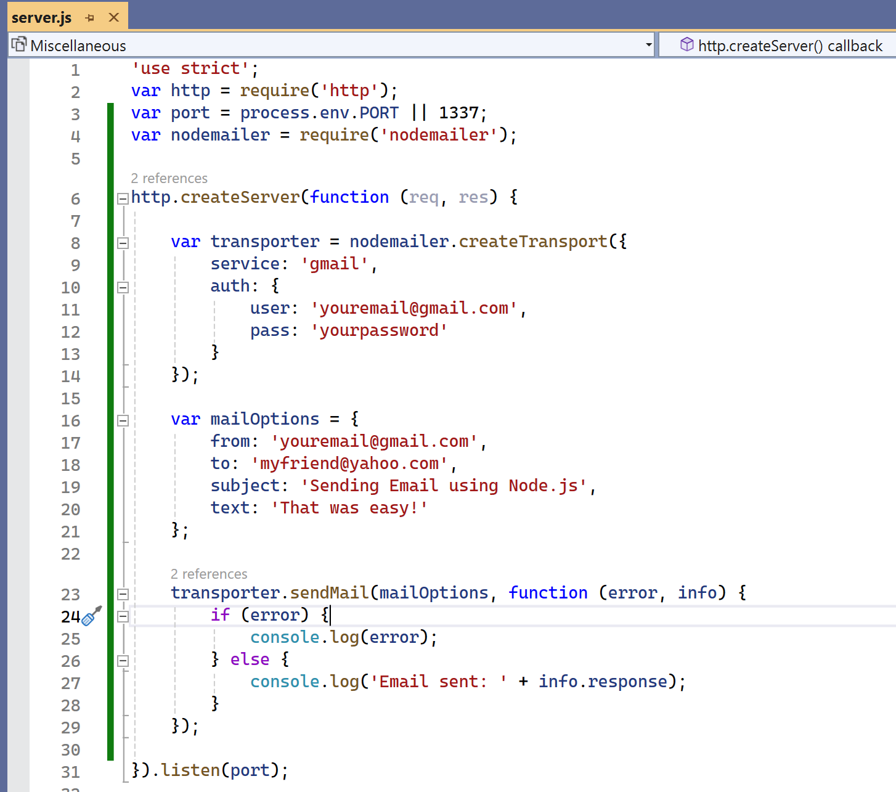


